<!-- TOC depthFrom:1 depthTo:6 withLinks:1 updateOnSave:1 orderedList:0 -->

- [扩充-NUMA](#扩充-numa)
	- [3种系统架构与2种存储器共享方式](#3种系统架构与2种存储器共享方式)
		- [系统架构-SMP](#系统架构-smp)
			- [SMP特点](#smp特点)
		- [系统架构-MMP](#系统架构-mmp)
		- [系统架构-NUMA](#系统架构-numa)
		- [多核处理器运行模式-SMP、AMP、BMP](#多核处理器运行模式-smpampbmp)
		- [共享存储UMA模型](#共享存储uma模型)
		- [共享存储NUMA模型](#共享存储numa模型)
	- [Linux中Node、Zone和页的关系](#linux中nodezone和页的关系)
	- [END](#end)

<!-- /TOC -->
# 扩充-NUMA


## 3种系统架构与2种存储器共享方式
```
在服务器的架构构方面一般可分为小型独立服务器模式、SMP（对称多处理）模式、MPP(大规模并行处理）模式和NUMA模式四类。

从系统架构来看，目前的商用服务器大体可以分为三类

  * 对称多处理器结构(SMP：Symmetric Multi-Processor)
  * 非一致存储访问结构(NUMA：Non-Uniform Memory Access)
  * 海量并行处理结构(MPP：Massive Parallel Processing)。

共享存储型多处理机有两种模型

  * 均匀存储器存取（Uniform-Memory-Access，简称UMA）模型
  * 非均匀存储器存取（Nonuniform-Memory-Access，简称NUMA）模型

多核处理器的运行模式有三种：
  * SMP-对称多处理，symmetric multi-processing。
  * AMP-非对称多处理，asymmetric multi-processing
  * BMP-边界多处理（翻译不确定），bound multi-processing

```

### 系统架构-SMP

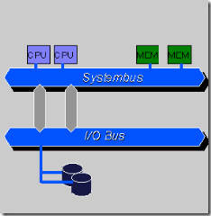


* 所谓对称多处理器结构，是指服务器中多个CPU对称工作，无主次或从属关系。
* SMP模式将多个处理器与一个集中的存储器相连。这是目前最为流行的一种服务器架构，因为它在低处理器系统中，通过简单地增加处理器数量线性地提高服务器性能。不仅许多服务器硬件，如CPU（包括各品牌服务器CPU）、芯片组等一般都支持SMP架构，就连所用操作系统也都基本上支持SMP，如Windows 2000 Server、Windows Server 2003和UNIX、LINUX系统。
* 在SMP模式下，所有处理器都可以访问同一个系统物理存储器，这就意味着SMP系统只运行操作系统的一个拷贝。因此SMP系统有时也被称为**一致存储器访问(UMA)结构体系**,**一致性意指无论在什么时候，处理器只能为内存的每个数据保持或共享惟一一个数值**。很显然，SMP的缺点是可伸缩性有限，因为在存储器接口达到饱和的时候，增加处理器并不能获得更高的性能。所以**一般来说采用SMP架构的服务器一般最多只能是8路处理器系统**。
* 对SMP服务器进行扩展的方式包括增加内存、使用更快的CPU、增加CPU、扩充I/O(槽口数与总线数)以及添加更多的外部设备(通常是磁盘存储)。
* SMP服务器的主要特征是共享，系统中所有资源(CPU、内存、I/O等)都是共享的。也正是由于这种特征，导致了SMP服务器的主要问题，那就是它的**扩展能力非常有限**。
* 对于SMP服务器而言，**每一个共享的环节都可能造成SMP服务器扩展时的瓶颈，而最受限制的则是内存**。由于每个CPU必须通过相同的内存总线访问相同的内存资源，因此**随着CPU数量的增加，内存访问冲突将迅速增加，最终会造成CPU资源的浪费，使CPU性能的有效性大大降低**。实验证明，SMP服务器CPU利用率最好的情况是2至4个CPU，但最多上面说到是8个。
* **物理存储器被所有处理机均匀共享。所有处理机对所有存储字具有相同的存取时间，这就是为什么称它为均匀存储器存取的原因**。每台处理机可以有私用高速缓存,外围设备也以一定形式共享

```
root@ubuntu16x64:~# ls /sys/devices/system/node/ -a
.   has_cpu     has_normal_memory  online    power
..  has_memory  node0              possible  uevent
```
如果目录列表/sys/devices/system/node/只看到一个node0 那就是smp架构

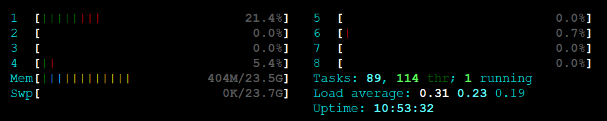

#### SMP特点

* SMP一般最多八路，支持最好的是2至4路
* 所有处理器都可以访问同一个系统物理存储器，且物理存储器被所有处理机均匀共享。所有处理机对所有存储字具有相同的存取时间
* 处理器只能为内存的每个数据保持或共享惟一一个数值
* CPU数量越多，冲突概率越大，单个CPU利用率越低
* 扩展能力有限


### 系统架构-MMP

* MPP模式则是一种分布式存储器模式，能够将更多的处理器纳入一个系统的存储器。**一个分布式存储器模式具有多个节点，每个节点都有自己的存储器，可以配置为SMP模式，也可以配置为非SMP模式**。单个的节点相互连接起来就形成了一个总系统。MPP体系结构对硬件开发商颇具吸引力，因为它们出现的问题比较容易解决，开发成本比较低。由于没有硬件支持共享内存或高速缓存一致性的问题，所以比较容易实现大量处理器的连接。可见，单一SMP模式与MPP模式的关键区别在于，**在SMP模式中，数据一致性是由硬件专门管理的，这样做比较容易实现，但成本较高**；在MPP模式中，节点之间的一致性是由软件来管理，因此，它的速度相对较慢，但成本却低得多。
* 和NUMA不同，MPP提供了另外一种进行系统扩展的方式，它由多个SMP服务器通过一定的节点互联网络进行连接，协同工作，完成相同的任务，从用户的角度来看是一个服务器系统。其基本特征是由多个SMP服务器(每个SMP服务器称节点)通过节点互联网络连接而成，每个节点只访问自己的本地资源(内存、存储等)，是一种完全无共享(Share Nothing)结构，因而扩展能力最好，理论上其扩展无限制，目前的技术可实现512个节点互联，数千个CPU。目前业界对节点互联网络暂无标准，如 NCR的Bynet，IBM的SPSwitch，它们都采用了不同的内部实现机制。但节点互联网仅供MPP服务器内部使用，对用户而言是透明的。
* 在MPP系统中，每个SMP节点也可以运行自己的操作系统、数据库等。但和NUMA不同的是，它不存在异地内存访问的问题。换言之，每个节点内的CPU不能访问另一个节点的内存。节点之间的信息交互是通过节点互联网络实现的，这个过程一般称为数据重分配(Data Redistribution)。
* 但是MPP服务器需要一种复杂的机制来调度和平衡各个节点的负载和并行处理过程。目前一些基于MPP技术的服务器往往通过系统级软件(如数据库)来屏蔽这种复杂性。举例来说，NCR的Teradata就是基于MPP技术的一个关系数据库软件，基于此数据库来开发应用时，不管后台服务器由多少个节点组成，开发人员所面对的都是同一个数据库系统，而不需要考虑如何调度其中某几个节点的负载。

### 系统架构-NUMA

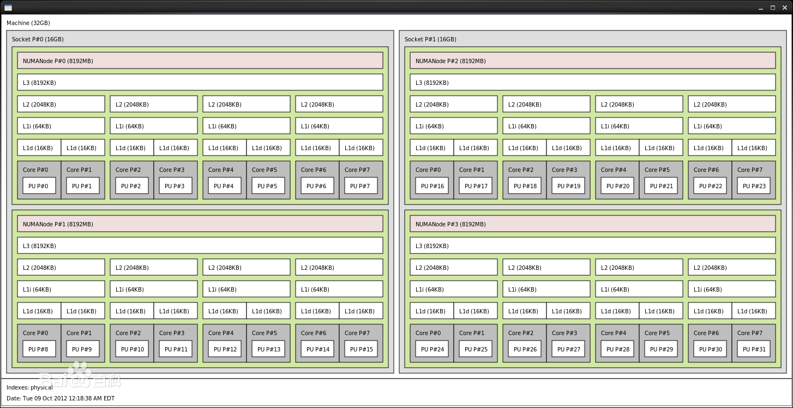

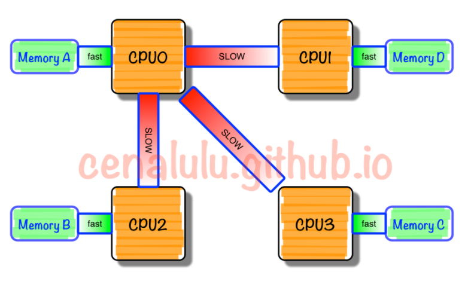

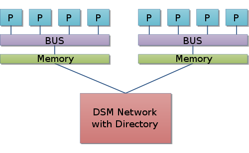

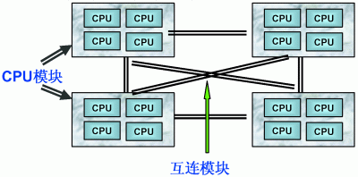


* 由于SMP在扩展能力上的限制，人们开始探究如何进行有效地扩展从而构建大型系统的技术，NUMA就是这种努力下的结果之一。利用NUMA技术，可以把几十个CPU(甚至上百个CPU)组合在一个服务器内。
* NUMA多处理机模型如图所示，其访问时间随存储字的位置不同而变化。其共享存储器物理上是分布在所有处理机的本地存储器上。**所有本地存储器的集合组成了全局地址空间，可被所有的处理机访问。处理机访问本地存储器是比较快的，但访问属于另一台处理机的远程存储器则比较慢，因为通过互连网络会产生附加时延。**
* NUMA服务器的基本特征是具有多个CPU模块，每个CPU模块由多个CPU(如4个)组成，并且具有独立的本地内存、I/O槽口等。
* NUMA模式也采用了MPP架构的分布式存储器模式，不同的是所有节点中的处理器都可以访问全部的系统物理存储器。然而，**每个处理器访问本节点内的存储器所需要的时间，可能比访问某些远程节点内的存储器所花的时间要少得多**。换句话说，也就是访问存储器的时间是不一致的，这也就是这种模式之所以 被称为“NUMA”的原因。简而言之，**NUMA既保持了SMP模式单一操作系统拷贝、简便的应用程序编程模式以及易于管理的特点，又继承了MPP模式的可扩充性，可以有效地扩充系统的规模，是SMP架构的模块化**。这也正是NUMA的优势所在。
* 总的来说，NUMA体系结构的优势主要体现在以下几个方面：
  - 首先，NUMA的突破性技术彻底摆脱了传统的超大总线对多处理结构的束缚。它大大增强单一操作系统可管理的处理器、内存和I/O插槽。
  - 其次，NUMA设计的重点是让处理器快速地访问在同一单元的内存，**NUMA处理器访问同一单元上的内存的速度比一般SMP模式超出一倍**。并且，**NUMA操作系统充分利用处理器缓存，能达到极高的寻址命中率**。**SMP模式虽然比NUMA简单，但是，所有的处理器访问内存的时间是一致且缓慢的**。同时，基于SMP 的总线存着在一个物理极限，令系统的扩充性逐步降低。此外，在基于SMP体系结构的大型系统中，平衡地增加处理器、I/O和内存变得更加困难。
  - 最后，**NUMA系统提供内存互联的硬件系统，这种技术可以开发新型动态的分区系统**。系统分区的好处在于允许系统管理员在同一计算机内运行多个操作系统（如 Unix和Windows NT），并根据用户工作负荷的要求，在不同的操作系统环境间，简单地管理和使用CPU和内存资源，从而实现最佳的性能和最高的资源利用率。
* **NUMA技术同样有一定缺陷，由于访问远地内存的延时远远超过本地内存，因此当CPU数量增加时，系统性能无法线性增加**。如HP公司发布Superdome服务器时，曾公布了它与HP其它UNIX服务器的相对性能值，结果发现，64路CPU的Superdome (NUMA结构)的相对性能值是20，而8路N4000(共享的SMP结构)的相对性能值是6.3. 从这个结果可以看到，8倍数量的CPU换来的只是3倍性能的提升.


### 多核处理器运行模式-SMP、AMP、BMP


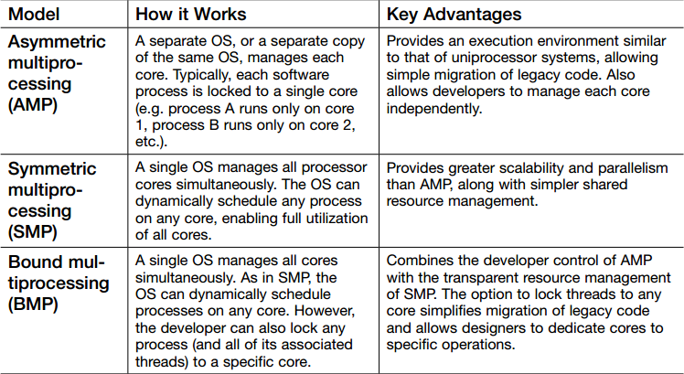


### 共享存储UMA模型


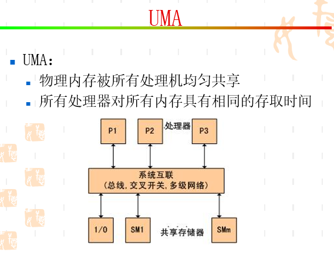


### 共享存储NUMA模型

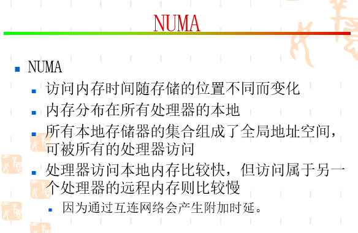

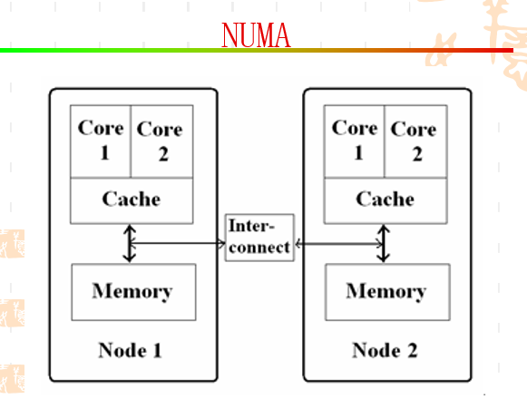

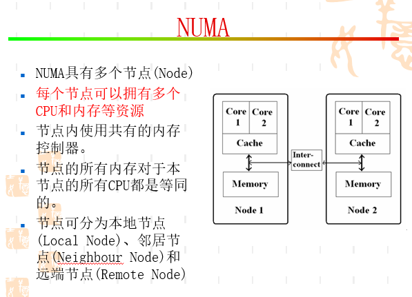


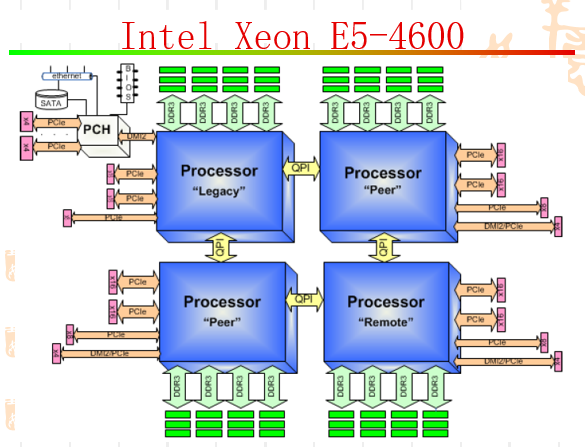


* 最早Intel在Nehalem架构上实现了NUMA，取代了在此之前一直使用的FSB前端总线的架构，用以对抗AMD的HyperTransport技术。一方面这个架构的特点是内存控制器从传统的北桥中移到了CPU中，排除了商业战略方向的考虑之外，这样做的方法同样是为了实现NUMA。

* NUMA（Non-Uniform Memory Access Architecture）即非一致性内存访问技术。NUMA系统有多个Node通过高速互连的网络联系起来的系统。而Node则是由一组cpu和本地内存组成。不同的Node有不同的物理内存，由于Node访问本地内存和访问其它节点的内存的速度是不一致的，为了解决非一致性访问内存对性能的影响，有一些工具可以使用。包括 numactl，autonuma， HPE-AIX等。


## Linux中Node、Zone和页的关系


对于NUMA系统来说，Linux会为每一个NUMA节点创建一套内存管理对象的实例，每个节点包含DMA, DMA32, NORMAL等Zone。当某个节点下的某个Zone无法满足内存分配请求时，系统会咨询zonelist进而决定后备Zone的选择顺序。当本地Zone NORMAL内存不足时，黙认顺序是从本地的Zone DMA32和DMA尝试，然后再尝试其它的节点。此顺序可以由numa_zonelist_order参数更改，比如先去尝试远程节点的Zone NORMAL以节省比较稀缺的Zone DMA32和DMA内存（当然，非黙认NUMA policy有可能偏好远程节点）。

```
root@ubuntu16x64:~/kernel/linux-4.4.124# numastat
                           node0
numa_hit               236044215
numa_miss                      0
numa_foreign                   0
interleave_hit             37759
local_node             236044215
other_node                     0
root@ubuntu16x64:~/kernel/linux-4.4.124#
```

## END
