# 扩充-Qemu内核调试

## Qemu简介

* Qemu是模拟器，KVM是内核虚拟化模块
* Qemu-KVM是两个开源项目的结合，KVM可以使用硬件虚拟化，但是不能硬件虚拟化的就需要Qemu来模拟。
* 建议开启KVM

## Qemu环境搭建

```
sudo apt-get install qemu-kvm -y
```

## busybox制作启动镜像

到busybox官网下载源码:<https://busybox.net/downloads/>
```
make menuconfig
```
勾选，弄成静态编译

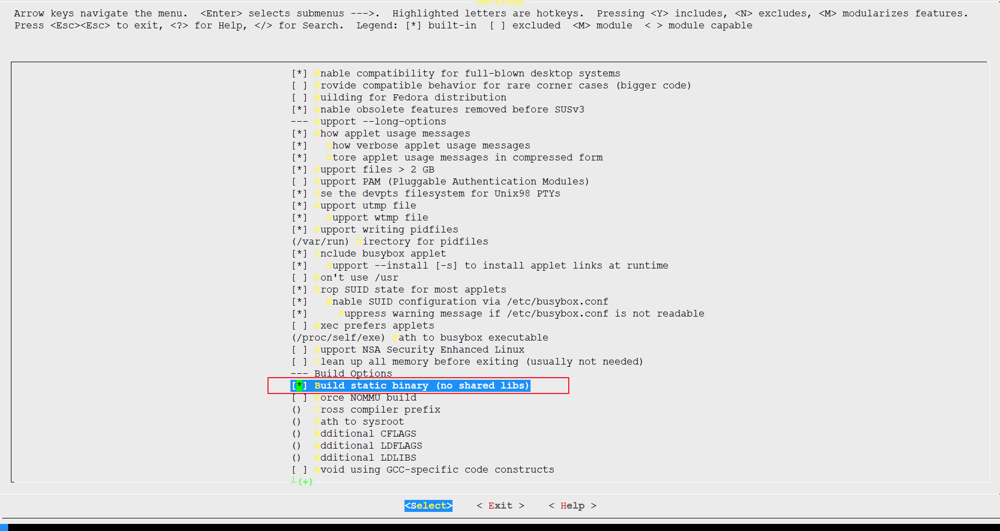

```
make install
```

会在当前目录下生成_install目录，进入该目录。进行一系列修改

```
mkdir -p etc dev mnt etc/init.d
```

进入etc/init.d/目录下,新建rcS文件。添加内容

```
mkdir -p /proc
mkdir -p /tmp
mkdir -p /sys
mkdir -p /mnt
/bin/mount -a
mkdir -p /dev/pts
mount -t devpts devpts /dev/pts
echo /sbin/mdev > /proc/sys/kernel/hotplug
mdev -s
```

进入etc/目录添加fstab文件，修改文件内容

```
proc /proc proc defaults 0 0
tmpfs /tmp tmpfs defaults 0 0
sysfs /sys sysfs defaults 0 0
debugfs /sys/kernel/debug debugfs defaults 0 0
```

进入etc/目录添加inittab文件，修改文件内容

```
::sysinit:/etc/init.d/rcS
::respawn:-/bin/sh
::askfirst:-/bin/sh
::ctrlaltdel:/bin/umount -a -r
```

最后在dev目录下创建设备节点，root权限要求

```
sudo mknod console c 5 1
sudo mknod null c 1 3
```

## 下载Linux内核

下载Linux内核源码:<https://kernel.org>

然后拷贝_install到内核源码顶层目录下

```
make menuconfig
```

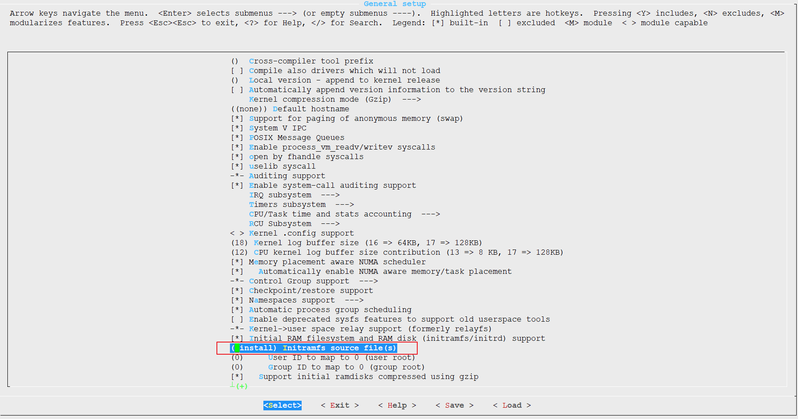

在Generl setup中配置Initramfs source file，也就是让busybox成为initramfs中的init


```
make bzImage -j16
```

-j16中是当前PC处理器线程数2倍，编译完成后

```
root@ubuntu16x64:~/kernel/linux-4.4.124# make bzImage -j16
  CHK     include/config/kernel.release
  CHK     include/generated/uapi/linux/version.h
  CHK     include/generated/utsrelease.h
  CHK     include/generated/timeconst.h
  CHK     include/generated/bounds.h
  CHK     include/generated/asm-offsets.h
  CALL    scripts/checksyscalls.sh
  CHK     include/generated/compile.h
  GEN     usr/initramfs_data.cpio.gz
  AS      usr/initramfs_data.o
  LD      usr/built-in.o
  LINK    vmlinux
  LD      vmlinux.o
  MODPOST vmlinux.o
  GEN     .version
  CHK     include/generated/compile.h
  UPD     include/generated/compile.h
  CC      init/version.o
  LD      init/built-in.o
  KSYM    .tmp_kallsyms1.o
  KSYM    .tmp_kallsyms2.o
  LD      vmlinux
  SORTEX  vmlinux
  SYSMAP  System.map
  VOFFSET arch/x86/boot/voffset.h
  CC      arch/x86/boot/version.o
  OBJCOPY arch/x86/boot/compressed/vmlinux.bin
  RELOCS  arch/x86/boot/compressed/vmlinux.relocs
  CC      arch/x86/boot/compressed/aslr.o
  GZIP    arch/x86/boot/compressed/vmlinux.bin.gz
  MKPIGGY arch/x86/boot/compressed/piggy.S
  AS      arch/x86/boot/compressed/piggy.o
  LD      arch/x86/boot/compressed/vmlinux
  ZOFFSET arch/x86/boot/zoffset.h
  OBJCOPY arch/x86/boot/vmlinux.bin
  AS      arch/x86/boot/header.o
  LD      arch/x86/boot/setup.elf
  OBJCOPY arch/x86/boot/setup.bin
  BUILD   arch/x86/boot/bzImage
Setup is 17404 bytes (padded to 17408 bytes).
System is 8323 kB
CRC 6784bdc3
Kernel: arch/x86/boot/bzImage is ready  (#8)
root@ubuntu16x64:~/kernel/linux-4.4.124# ll arch/x86/boot/bzImage
-rw-r--r-- 1 root root 8.2M 7月  21 15:09 arch/x86/boot/bzImage
root@ubuntu16x64:~/kernel/linux-4.4.124# file $_
arch/x86/boot/bzImage: Linux kernel x86 boot executable bzImage, version 4.4.124 (root@ubuntu16x64) #8 SMP Sat Jul 21 15:09:03 CST 2018, RO-rootFS, swap_dev 0x8, Normal VGA
```

## Qemu启动Linux内核

```
qemu-system-x86_64 -kernel ./arch/x86_64/boot/bzImage -k en-us
```

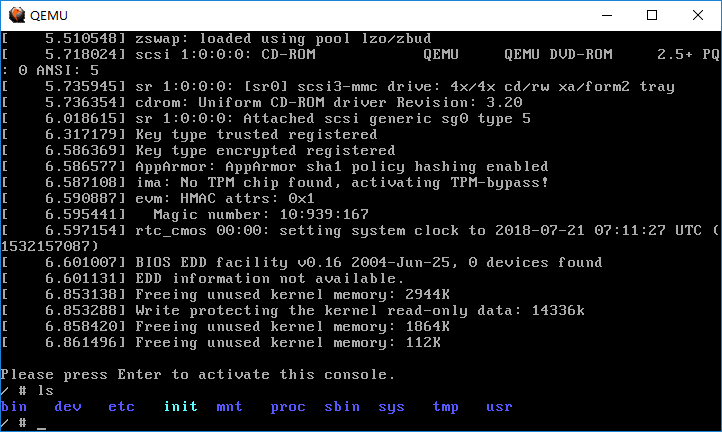

完美进入

## Qemu调试Linux内核


```
qemu-system-x86_64 -kernel ./arch/x86_64/boot/bzImage -k en-us -S -s
```
-S:冻结虚拟机执行
-s:默认1234端口接受GDB调试


```
root@ubuntu16x64:~/kernel/linux-4.4.124# gdb vmlinux
GNU gdb (Ubuntu 7.11.1-0ubuntu1~16.5) 7.11.1
Copyright (C) 2016 Free Software Foundation, Inc.
License GPLv3+: GNU GPL version 3 or later <http://gnu.org/licenses/gpl.html>
This is free software: you are free to change and redistribute it.
There is NO WARRANTY, to the extent permitted by law.  Type "show copying"
and "show warranty" for details.
This GDB was configured as "x86_64-linux-gnu".
Type "show configuration" for configuration details.
For bug reporting instructions, please see:
<http://www.gnu.org/software/gdb/bugs/>.
Find the GDB manual and other documentation resources online at:
<http://www.gnu.org/software/gdb/documentation/>.
For help, type "help".
Type "apropos word" to search for commands related to "word"...
Reading symbols from vmlinux...done.
warning: File "/root/kernel/linux-4.4.124/scripts/gdb/vmlinux-gdb.py" auto-loading has been declined by your `auto-load safe-path' set to "$debugdir:$datadir/auto-load".
To enable execution of this file add
---Type <return> to continue, or q <return> to quit---
```

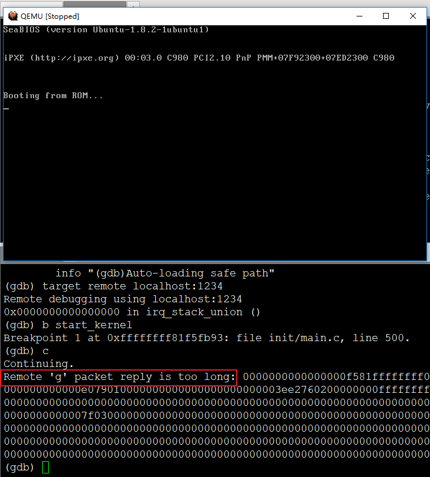

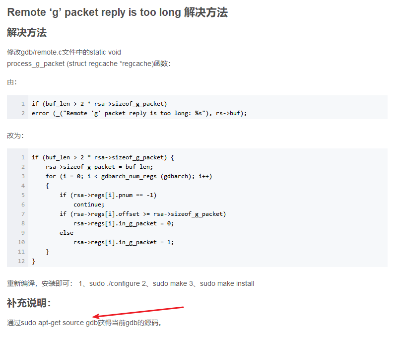

* gdb调试内核从来没有一次成功过，都需要修改gdb源码。按这个套路来整


由：
```
if (buf_len > 2 * rsa->sizeof_g_packet)
error (_("Remote 'g' packet reply is too long: %s"), rs->buf);
```
改为：
```
if (buf_len > 2 * rsa->sizeof_g_packet) {
    rsa->sizeof_g_packet = buf_len;
    for (i = 0; i < gdbarch_num_regs (gdbarch); i++)
    {
        if (rsa->regs[i].pnum == -1)
            continue;
        if (rsa->regs[i].offset >= rsa->sizeof_g_packet)
            rsa->regs[i].in_g_packet = 0;
        else
            rsa->regs[i].in_g_packet = 1;
    }
}
```

虽然不一定有效，真的，CSDN上一大波垃圾博文乱抄。。然而都并不管用。。真尴尬，浪费时间

## 神器ddd

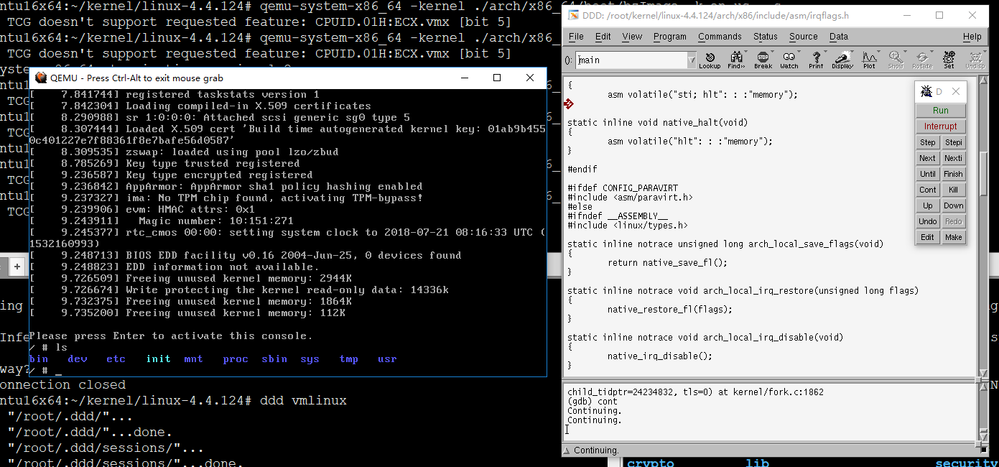

* 谁用谁说好

```
qemu-system-x86_64 -kernel ./arch/x86_64/boot/bzImage -k en-us  -S -s
```
虚拟机进入调试状态，等待连接调试

```
root@ubuntu16x64:~/kernel/linux-4.4.124# ddd vmlinux
```

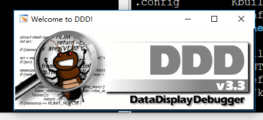

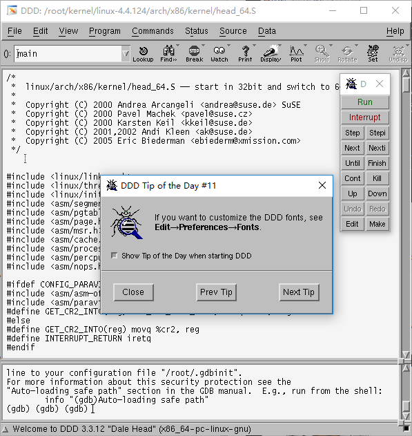

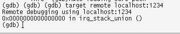

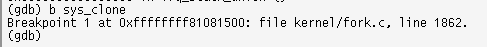

* 设置断点


* c:continue 让内核跑起来，初始化一波东西，进入用户态，然后用户态会调用clone创建子进程，这时候捕获中断

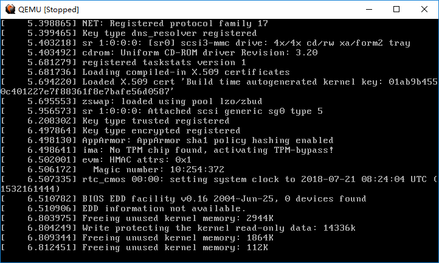

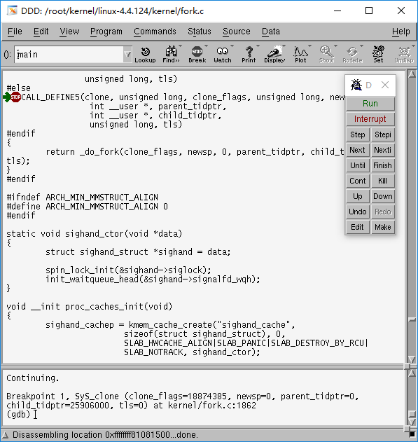

* 巨美好的界面出现了，你可随意下断点，随意调试~happy 不？
* 如此神奇，奔跑Linux居然没给出。。笨叔叔是藏着掖着了么

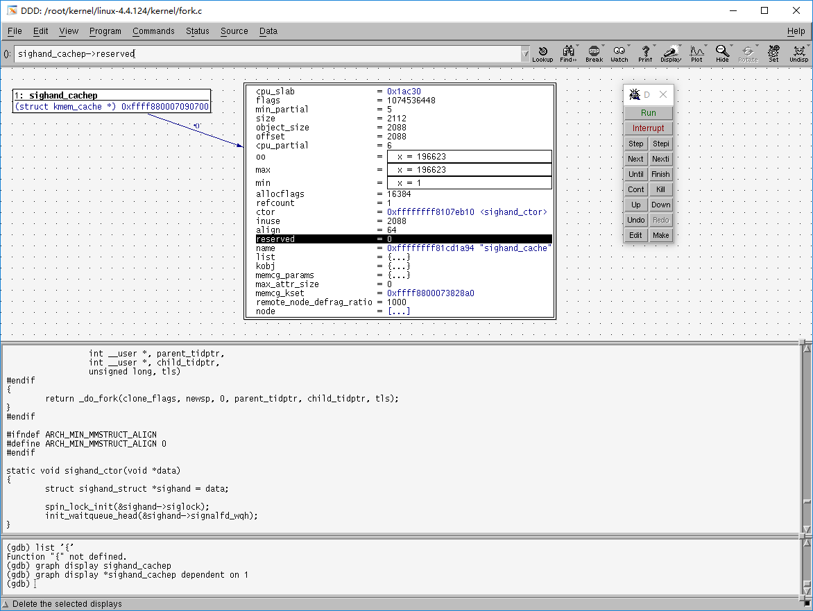

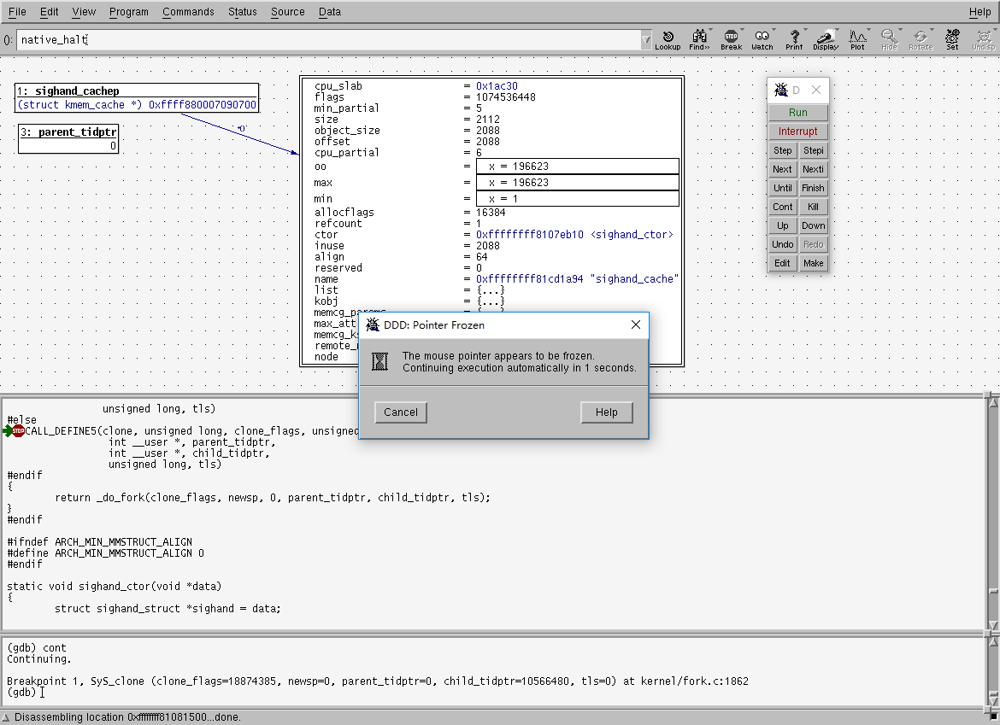

ddd官网:<http://www.gnu.org/software/ddd/>

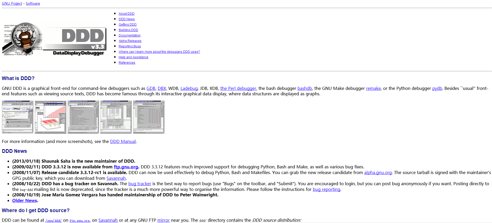

```
宇宙最强调试器DDD（Data Display Debugger）
```


## 参考内容

天佑koala:<https://blog.csdn.net/u013592097/article/details/70549657>

## END
