# 扩充-宇宙最强调试器DDD

* GNU DDD是命令行调试程序，如GDB、DBX、WDB、Ladebug、JDB、XDB、Perl Debugger或Python Debugger的可视化图形前端。它特有的图形数据显示功能（Graphical Data Display）可以把数据结构按照图形的方式显示出来。DDD最初源于1990年Andreas Zeller编写的VSL结构化语言，后来经过一些程序员的努力，演化成今天的模样。DDD的功能非常强大，可以调试用C\C++、Ada、 Fortran、Pascal、Modula-2和Modula-3编写的程序；可以超文本方式浏览源代码；能够进行断点设置、回溯调试和历史纪录编辑；具有程序在终端运行的仿真窗口，并在远程主机上进行调试的能力；图形数据显示功能（Graphical Data Display）是创建该调试器的初衷之一，能够显示各种数据结构之间的关系，并将数据结构以图形化形式显示；具有GDB/DBX/XDB的命令行界面，包括完全的文本编辑、历史纪录、搜寻引擎。

* 在设计DDD的时候，主创人员决定把它与GDB之间的耦合度尽可能降小。因为像GDB这样的开源软件，更新要比商业软件快。所以为了使GDB的变化不会影响到DDD，在DDD中，GDB是作为独立的进程运行的，通过命令行接口与DDD进行交互。

* DDD还有一些与众不同的功能，例如可视化显示数据结构（单个结构体、二叉树、链表等）和绘制数据集等。

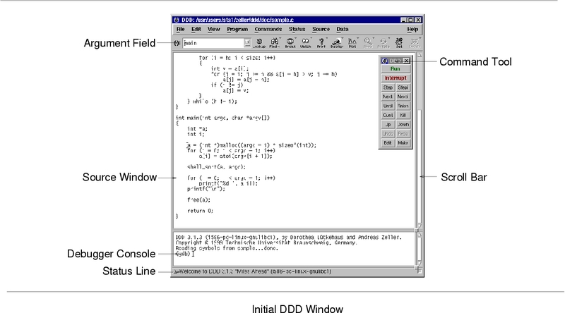

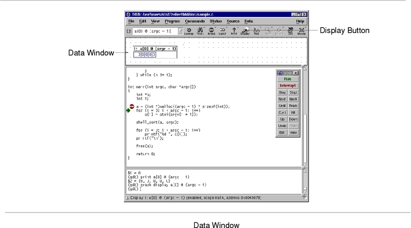

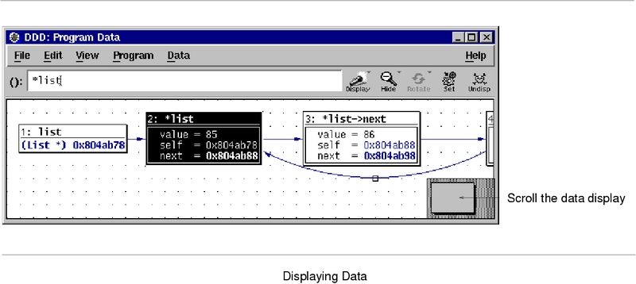

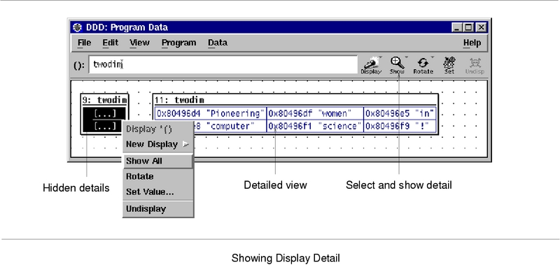

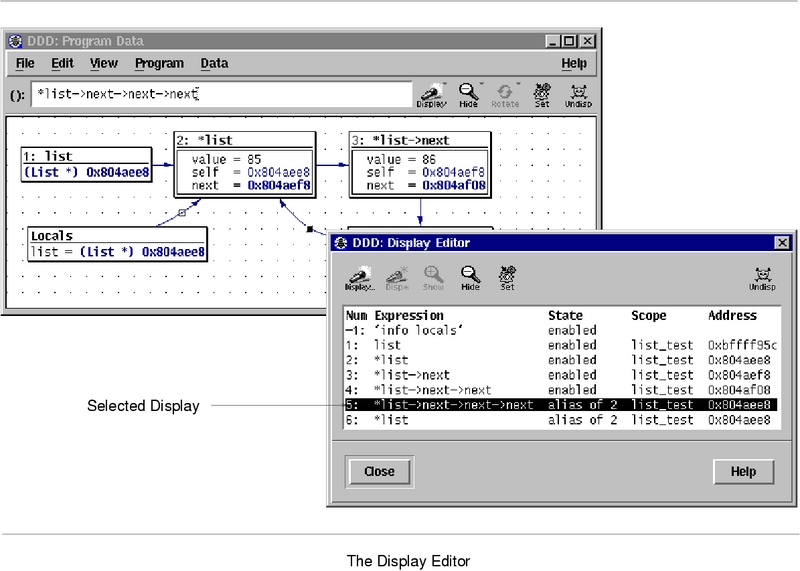

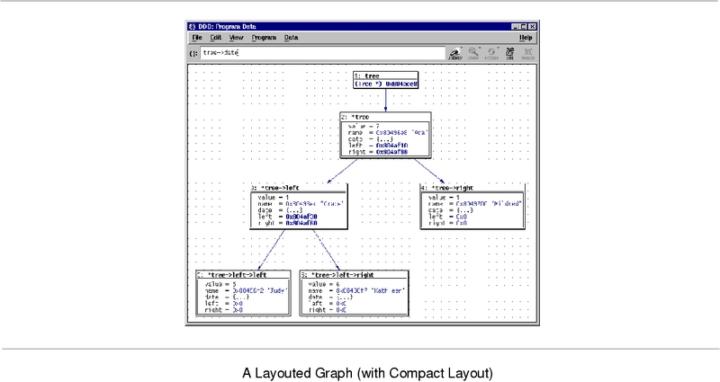

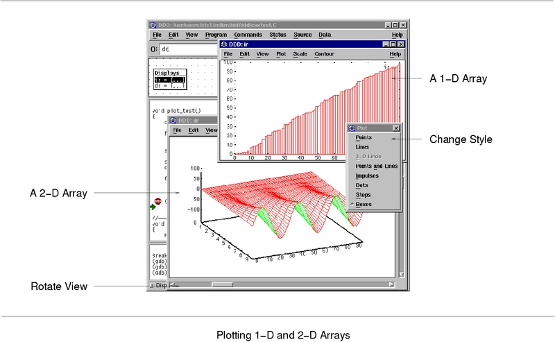

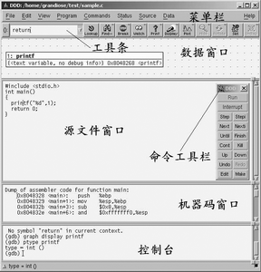

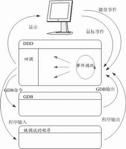

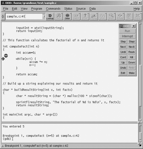

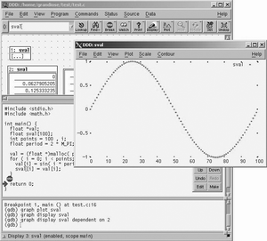

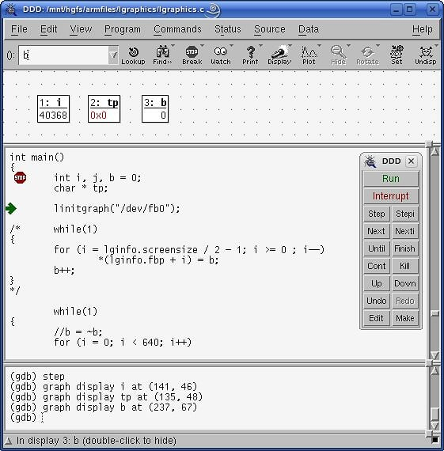

## 参考博客

<http://www.cnblogs.com/spinsoft/archive/2012/07/09/2582089.html>
