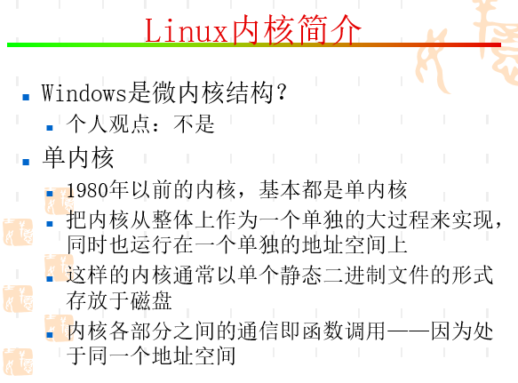
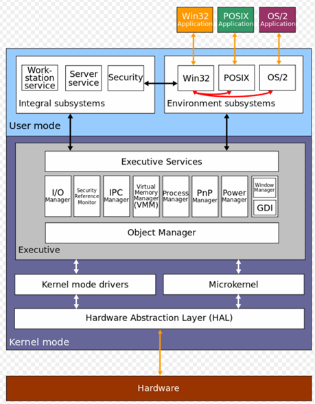
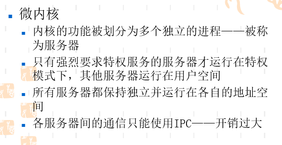
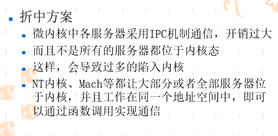
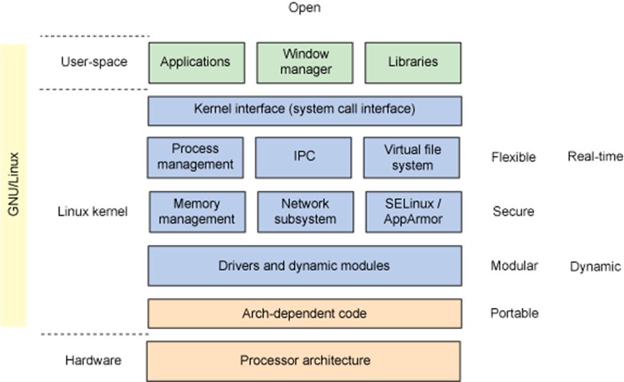
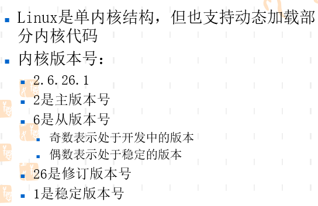

<!-- TOC depthFrom:1 depthTo:6 withLinks:1 updateOnSave:1 orderedList:0 -->

- [Linux内核简介](#linux内核简介)
	- [Windows单内核系统](#windows单内核系统)
	- [Linux宏内核](#linux宏内核)
	- [END](#end)

<!-- /TOC -->
# Linux内核简介

## Windows单内核系统

* 简单地说。宏内核就是一个饭团，每一粒米都是一个功能模块组成，各个模块整合到一起，不可分割。
* 在宏内核中内核模块，就是饭团弄好之后撒上的调料

* 微内核是什么？反正。我能想到的吃的东西，就是拼盘。凉菜拼盘，海鲜拼盘。各个模块相互独立。

* 微内核之间相互通信，效率低下。开销过大。

## Linux宏内核

* 反正从版本号看稳定性，最后第四个稳定版本是衍生的。稳定中的稳定。

## END
