<!-- TOC depthFrom:1 depthTo:6 withLinks:1 updateOnSave:1 orderedList:0 -->

- [内核实证](#内核实证)
	- [内核学习方法](#内核学习方法)
	- [内核模块模型](#内核模块模型)
		- [输出调试信息的函数printk](#输出调试信息的函数printk)
		- [Makefile文件](#makefile文件)
		- [优化和调试级别](#优化和调试级别)
	- [内核开发的特点](#内核开发的特点)
	- [修改内核源码](#修改内核源码)
		- [initrd](#initrd)
	- [kgdb调试内核](#kgdb调试内核)
	- [UML调试内核](#uml调试内核)
	- [Qemu调试内核](#qemu调试内核)
	- [END](#end)

<!-- /TOC -->

# 内核实证

## 内核学习方法

不仅仅是了解Linux内核的基本原理和结构特征,更重要的是掌握如何探索这些原理和特征的方法

内核不断在进步，当前内核版本已经是4.9,而大部分内核书籍还是2.6.*，非常落后,开发环境是3.*，又当如何？

```
万变不离其宗，把握核心知识，核心原理，核心概念
```

达到上述目的的方法：内核实证

* 动手：利用程序员的手段，来了解、理解、掌握Linux内核基本原理和关键技术
* 千万不能只看书

程序员手段

* 编写内核模块
* **驱动程序，站在内核使用者的角度，感性认识内核**
* 了解内核的编程接口、关键数据结构。比如kmalloc、四级页表结构
* 调试内核及内核模块
* 帮助理解内核的内部处理流程、关键数据结构。比如sys_clone的处理流程
* 修改内核源码
  - 为内核增加新功能，验证新方法
  - 比如增加新的系统调用，测试新的调度算法
* 汇编与反汇编
  - **内核与体系结构关系密切**，比如GDTR、CR3、int 3


## 内核模块模型


* 驱动和一般应用程序的执行方式很大不同

一般应用由main函数开始执行，流程基本由程序自身控制
驱动程序没有main函数，由回调方式驱动运行

* 回调方式
  - 先向内核注册函数，然后应用程序触发这些函数的执行
  - 例如：驱动程序在初始化时，向内核注册处理某个设备写操作的函数
  - 当应用程序使用write系统调用写该设备时，内核就会调用注册的上述函数

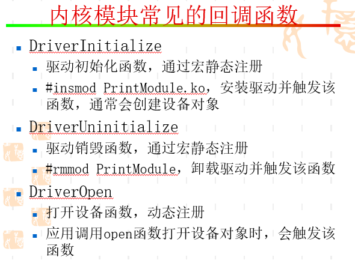

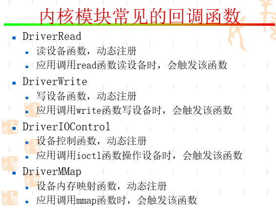

### 输出调试信息的函数printk

```
 #include<linux/kernel.h>
int printk(const char * fmt, …)
```
dmesg命令查看调试信息


### Makefile文件

```
ifneq ($(KERNELRELEASE),)
	obj-m := PrintModule.o
	PrintModule-objs := DriverMain.o DriverFileOperations.o
EXTRA_CFLAGS := -DTEST_DEBUG -ggdb -O0
else
	KERNELDIR ?= /lib/modules/$(shell uname -r)/build
	PWD := $(shell pwd)
default:
	$(MAKE) -C $(KERNELDIR) M=$(PWD) modules
endif

```

* 检查Makefile中是否定义了KERNELRELEASE,ifneq表示当前未定义

* KERNELDIR ?= /lib/modules/$(shell uname -r)/build
  - **?=：表示若KERNELDIR还未赋过值，则赋值**
  - $(shell uname -r)：获取当前内核版本号
  - /lib/modules/$(shell uname -r)目录存放了各种编译好的内核模块、符号信息等
  - build往往是一个**符号链接**，指向的目录包含了内核头文件，用于编译内核模块的各个Makefile
  - PWD := $(shell pwd) 用于保存当前目录

```
root@ubuntu16x64:/lib/modules/4.4.0-130-generic# ls
build   kernel         modules.alias.bin  modules.builtin.bin  modules.dep.bin  modules.order    modules.symbols      vdso
 initrd  modules.alias  modules.builtin    modules.dep          modules.devname  modules.softdep  modules.symbols.bin
root@ubuntu16x64:/lib/modules/4.4.0-130-generic# ll build
lrwxrwxrwx 1 root root 40 6月  14 21:32 build -> /usr/src/linux-headers-4.4.0-130-generic/
root@ubuntu16x64:/lib/modules/4.4.0-130-generic# ll /usr/src/linux-headers-4.4.0-130-generic/
总用量 1.6M
drwxr-xr-x 7 root root 4.0K 7月   6 10:33 ./
drwxr-xr-x 8 root root 4.0K 7月   3 13:16 ../
-rw-r--r-- 1 root root   21 6月  14 21:31 .2359.d
drwxr-xr-x 3 root root 4.0K 7月   3 13:15 arch/
lrwxrwxrwx 1 root root   32 6月  14 21:32 block -> ../linux-headers-4.4.0-130/block/
lrwxrwxrwx 1 root root   32 6月  14 21:31 certs -> ../linux-headers-4.4.0-130/certs/
-rw-r--r-- 1 root root 186K 6月  14 21:31 .config
-rw-r--r-- 1 root root 187K 6月  14 21:31 .config.old
lrwxrwxrwx 1 root root   33 6月  14 21:32 crypto -> ../linux-headers-4.4.0-130/crypto/
lrwxrwxrwx 1 root root   40 6月  14 21:32 Documentation -> ../linux-headers-4.4.0-130/Documentation/
lrwxrwxrwx 1 root root   34 6月  14 21:31 drivers -> ../linux-headers-4.4.0-130/drivers/
lrwxrwxrwx 1 root root   35 6月  14 21:31 firmware -> ../linux-headers-4.4.0-130/firmware/
lrwxrwxrwx 1 root root   29 6月  14 21:32 fs -> ../linux-headers-4.4.0-130/fs/
drwxr-xr-x 4 root root 4.0K 7月   3 13:15 include/
lrwxrwxrwx 1 root root   31 6月  14 21:31 init -> ../linux-headers-4.4.0-130/init/
lrwxrwxrwx 1 root root   30 6月  14 21:32 ipc -> ../linux-headers-4.4.0-130/ipc/
lrwxrwxrwx 1 root root   33 6月  14 21:32 Kbuild -> ../linux-headers-4.4.0-130/Kbuild
lrwxrwxrwx 1 root root   34 6月  14 21:32 Kconfig -> ../linux-headers-4.4.0-130/Kconfig
drwxr-xr-x 2 root root 4.0K 7月   3 13:15 kernel/
lrwxrwxrwx 1 root root   30 6月  14 21:32 lib -> ../linux-headers-4.4.0-130/lib/
lrwxrwxrwx 1 root root   35 6月  14 21:32 Makefile -> ../linux-headers-4.4.0-130/Makefile
-rw-r--r-- 1 root root  820 6月  14 21:31 .missing-syscalls.d
lrwxrwxrwx 1 root root   29 6月  14 21:32 mm -> ../linux-headers-4.4.0-130/mm/
-rw-r--r-- 1 root root 1.2M 6月  14 21:32 Module.symvers
lrwxrwxrwx 1 root root   30 6月  14 21:32 net -> ../linux-headers-4.4.0-130/net/
lrwxrwxrwx 1 root root   34 6月  14 21:32 samples -> ../linux-headers-4.4.0-130/samples/
drwxr-xr-x 7 root root 4.0K 7月   3 13:15 scripts/
lrwxrwxrwx 1 root root   35 6月  14 21:32 security -> ../linux-headers-4.4.0-130/security/
lrwxrwxrwx 1 root root   32 6月  14 21:32 sound -> ../linux-headers-4.4.0-130/sound/
lrwxrwxrwx 1 root root   31 7月   6 10:33 source -> /root/mokee/kernel/xiaomi/aries/
lrwxrwxrwx 1 root root   30 6月  14 21:32 spl -> ../linux-headers-4.4.0-130/spl/
drwxr-xr-x 2 root root 4.0K 6月  14 21:31 .tmp_versions/
lrwxrwxrwx 1 root root   32 6月  14 21:32 tools -> ../linux-headers-4.4.0-130/tools/
lrwxrwxrwx 1 root root   33 6月  14 21:32 ubuntu -> ../linux-headers-4.4.0-130/ubuntu/
lrwxrwxrwx 1 root root   30 6月  14 21:32 usr -> ../linux-headers-4.4.0-130/usr/
lrwxrwxrwx 1 root root   31 6月  14 21:32 virt -> ../linux-headers-4.4.0-130/virt/
lrwxrwxrwx 1 root root   30 6月  14 21:32 zfs -> ../linux-headers-4.4.0-130/zfs/
root@ubuntu16x64:/usr/src# ll
总用量 32K
drwxr-xr-x  8 root root 4.0K 7月   3 13:16 ./
drwxr-xr-x 14 root root 4.0K 5月  21 22:13 ../
drwxr-xr-x  2 root root 4.0K 6月  12 08:40 linux-headers-4.4.0-124-generic/
drwxr-xr-x 27 root root 4.0K 6月  12 08:39 linux-headers-4.4.0-128/
drwxr-xr-x  7 root root 4.0K 6月  12 08:39 linux-headers-4.4.0-128-generic/
drwxr-xr-x 27 root root 4.0K 7月   3 13:15 linux-headers-4.4.0-130/
drwxr-xr-x  7 root root 4.0K 7月   6 10:33 linux-headers-4.4.0-130-generic/
drwxr-xr-x  5 root root 4.0K 5月  21 22:51 qtcreator/
```
* $(MAKE) -C $(KERNELDIR) M=$(PWD) modules
  - MAKE：执行make操作
  - -C：切换目录到$(KERNELDIR)
  - 此时，开始执行$(KERNELDIR) 目录下的Makefile（顶层Makefile）
  - 在该Makefile中，定义了KERNELRELEASE
  - M：表示在构造模块之前，回到目录PWD，再次执行当前目录下的Makefile
* Linux内核顶层Makefile是个学习Makefile的好材料

```
root@ubuntu16x64:/lib/modules/4.4.0-130-generic/build# cat Makefile |grep KERNELRELEASE
UBUNTUINCLUDE := -I/usr/src/linux-headers-lbm-$(KERNELRELEASE)
 # Read KERNELRELEASE from include/config/kernel.release (if it exists)
KERNELRELEASE = $(shell cat include/config/kernel.release 2> /dev/null)
export VERSION PATCHLEVEL SUBLEVEL KERNELRELEASE KERNELVERSION
export INSTALL_DTBS_PATH ?= $(INSTALL_PATH)/dtbs/$(KERNELRELEASE)
MODLIB	= $(INSTALL_MOD_PATH)/lib/modules/$(KERNELRELEASE)
 # Store (new) KERNELRELEASE string in include/config/kernel.release
 # KERNELRELEASE can change from a few different places, meaning version.h
	if [ `echo -n "$(KERNELRELEASE)" | wc -c ` -gt $(uts_len) ]; then \
	  echo '"$(KERNELRELEASE)" exceeds $(uts_len) characters' >&2;    \
	(echo \#define UTS_RELEASE \"$(KERNELRELEASE)\";)
quiet_cmd_depmod = DEPMOD  $(KERNELRELEASE)
                   $(KERNELRELEASE) "$(patsubst y,_,$(CONFIG_HAVE_UNDERSCORE_SYMBOL_PREFIX))"
root@ubuntu16x64:/lib/modules/4.4.0-130-generic/build# find ./ -name kernel.release
./include/config/kernel.release
root@ubuntu16x64:/lib/modules/4.4.0-130-generic/build# cat ./include/config/kernel.release
4.4.0-130-generic
```
* 很明显看出，KERNELRELEASE就是文件kernel.release内容

```
  obj-m := PrintModule.o
	PrintModule-objs := DriverMain.o DriverFileOperations.o
EXTRA_CFLAGS := -DTEST_DEBUG -ggdb -O0

```
* obj-m说明有一个模块需要从目标文件PrintModule.o中构造，而该模块名为PrintModule.ko
* PrintModule-objs说明PrintModule由多个目标文件构成；一个编译单元一个目标文件（.o文件）
```
-DTEST_DEBUG：自定义宏
-ggdb：加入调试信息
-O0：优化级别
```

### 优化和调试级别

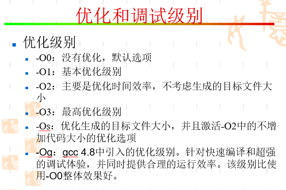

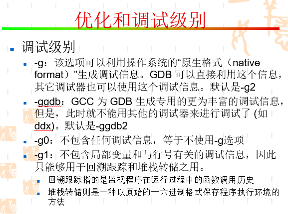

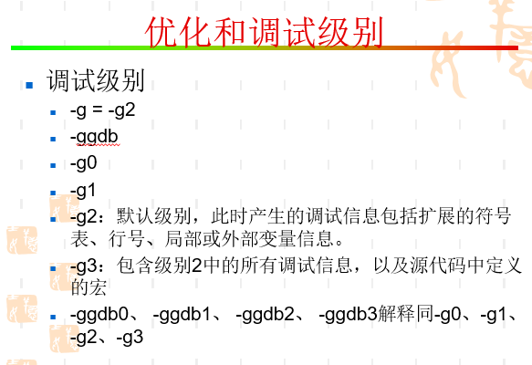

## 内核开发的特点

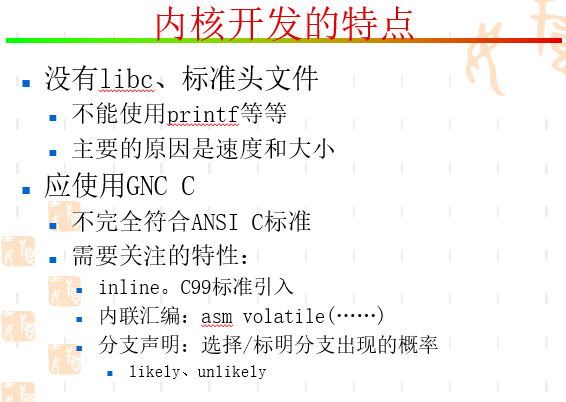

* 内核从系统启动阶段到怠速状态。其间不可能有用户库环境资源，就算有，效率低下不会使用。所以尽可能使用高效方式。所使用的函数基本包含在内核镜像中。
* 使用了很多GNU C的特性
* 堆栈特别小，内核堆栈跟PCB公用一页内存
* 没有内存保护机制，内核代码一旦奔溃，系统就宕机
* 没有浮点运算，浮点运算需要模式转换
* 没有标准C库，标准C库是在用户态运行，init就是用户态程序，他就可以用C库，但是在此之前进程0也就是idle进程，代码就是在内核中，由进程0调用init，进程0经历了内核态到用户态的转变。用户态的执行仅仅sys_pause（）,可用于统计系统空闲状态。

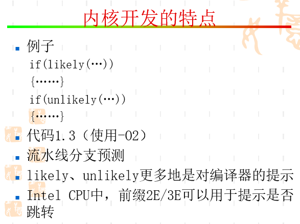

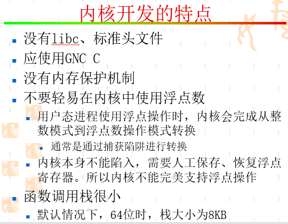


## 修改内核源码

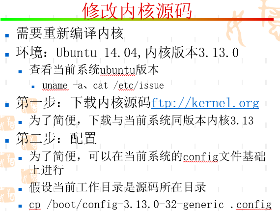

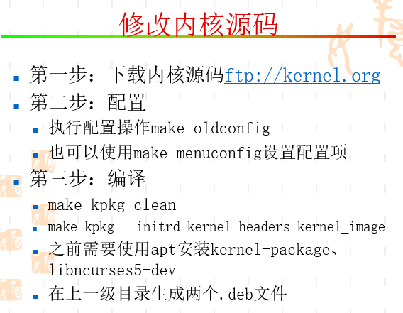

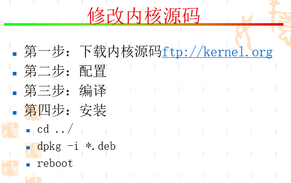

* 修改内核源码就是要重新编译，重启调试，没办法，用的宏内核
* 但如果是内核模块就简单多了，无需重启，可拔插


一般内核编译过程包括
* make menuconfig 文本模式图形化界面配置，配置好生成.config
* make 编译所有模块，但未安装
* make modules_install 生成各个模块，会放在/lib/modules/$kernel_version/kernel目录下
* make install 会安装kernel和initramfs

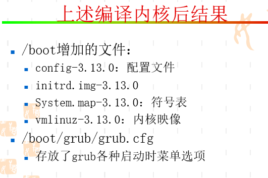

* config是内核配置文件，如果下次编译可以用make oldconfig
* initrd是initramfs虚拟盘，用来加载rootfs以及初始化环境，包括了init进程(2016BlackHat攻击涉及)。因为包括了一些环境驱动，以及标准库，所以体积会很大。
* vmlinuz是完整内核映像
* System.map是系统符号表，告诉你哪个符号在哪个虚拟地址，一般都是内核空间。

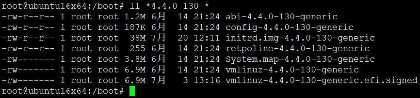

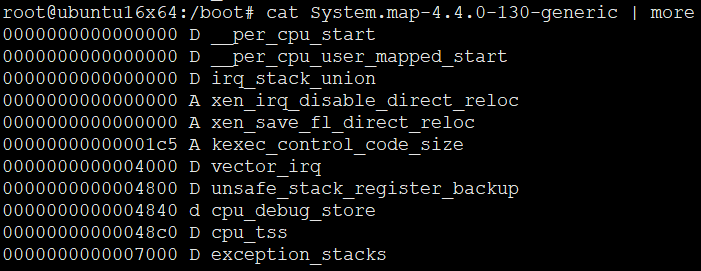

### initrd

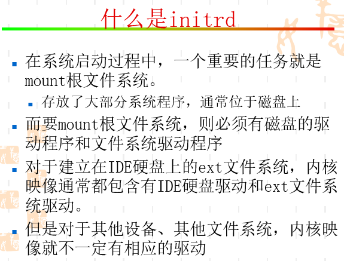

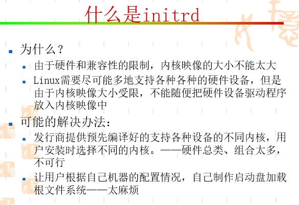

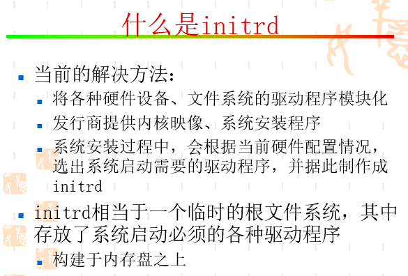


## kgdb调试内核

* 笨叔叔说kgdb太low了，用Qemu~

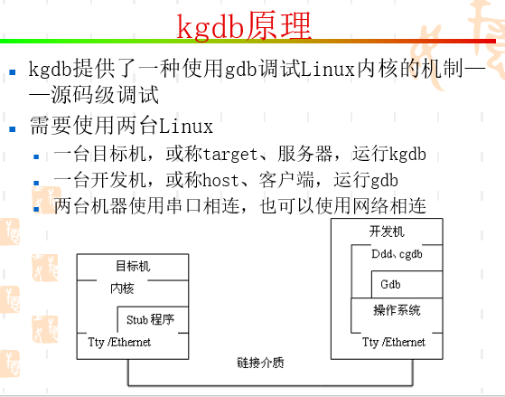

* kgdb就是串口调试，win也有

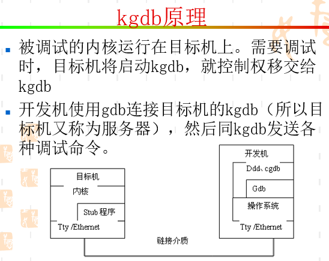

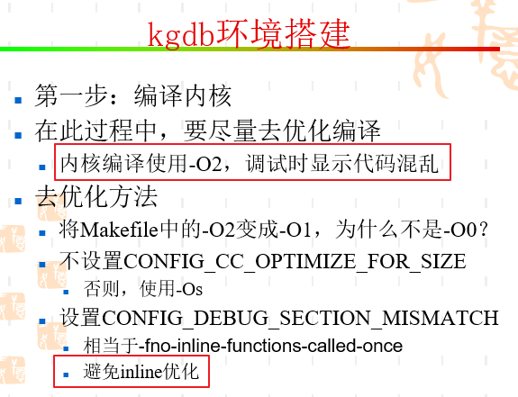

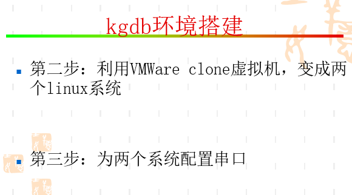

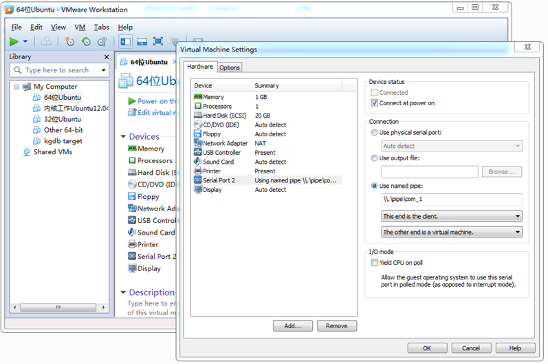

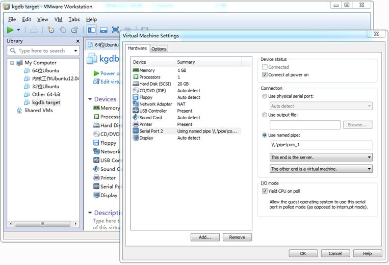

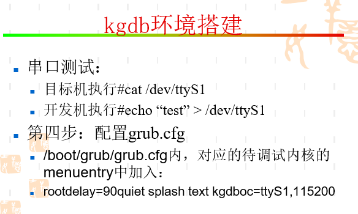

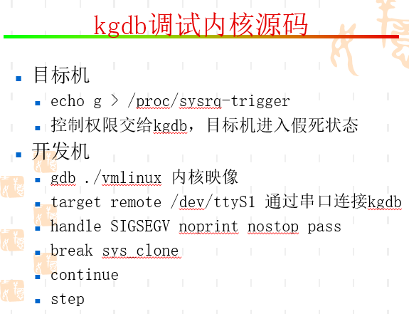

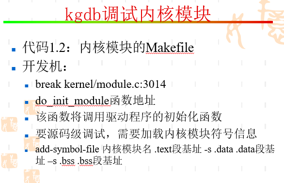


## UML调试内核

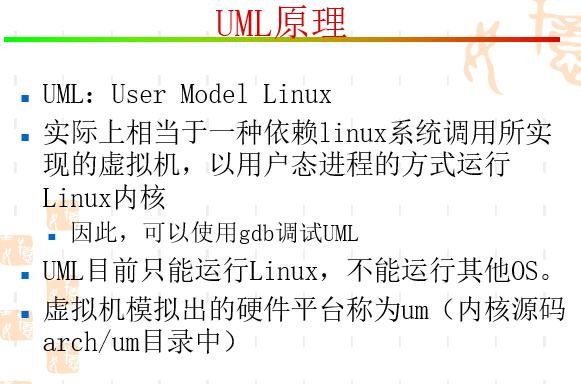


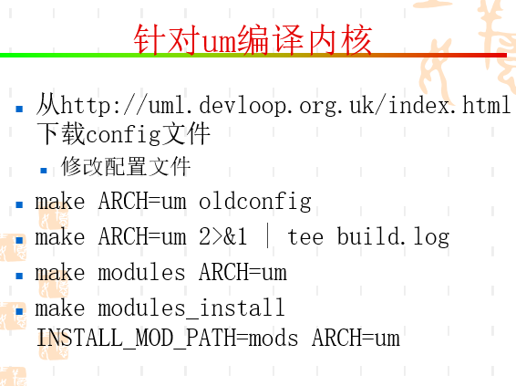


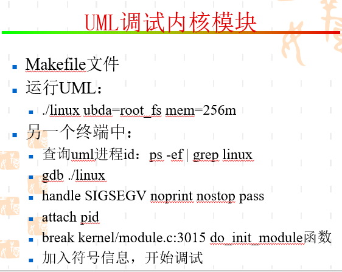


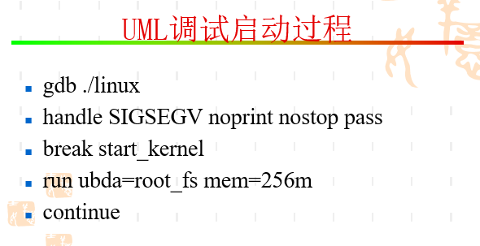


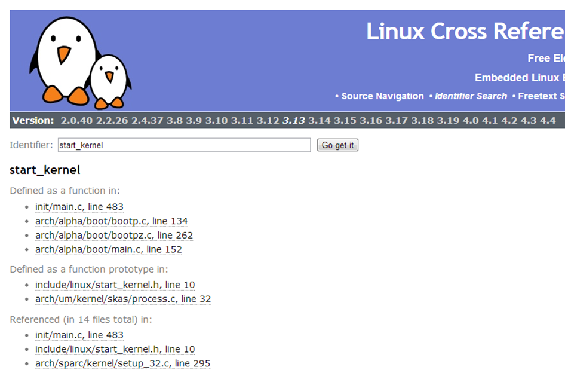


## Qemu调试内核

* 学习笨叔叔的方法


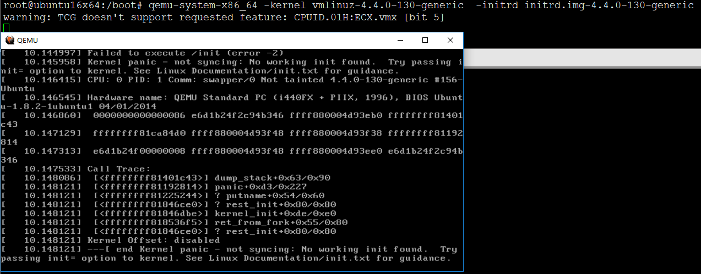

* 直接上/boot分区下的initramfs和内核镜像不得行哦。为嘛？找不到init？
```
本仓库在林大佬PPT基础上扩充了一些内容。
Qemu内核调试请到 扩充-Qemu内核调试 查看
```


## END
