<!-- TOC depthFrom:1 depthTo:6 withLinks:1 updateOnSave:1 orderedList:0 -->

- [node与zone](#node与zone)
	- [node](#node)
	- [zone](#zone)
	- [添加ZONE_MOVABLE](#添加zonemovable)
	- [page结构转node和zone](#page结构转node和zone)
	- [参考博客](#参考博客)
	- [END](#end)

<!-- /TOC -->
# node与zone

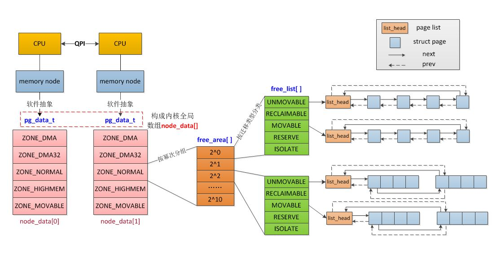

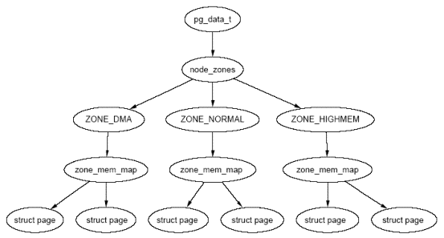

* 在NUMA模型中，每个CPU都有自己的本地内存节点（memory node），而且还可以**通过QPI总线访问其他CPU下挂的内存节点，只是访问本地内存要比访问其他CPU下的内存的速度高许多，一般经过一次QPI要增加30%的访问时延。**
* Linux中对所有的内存进行统一管理，但由于关联不同的CPU导致访问速度不同，因此又将内存划分为节点（node）；在节点内部，又进一步细分为内存域（zone）。

## node

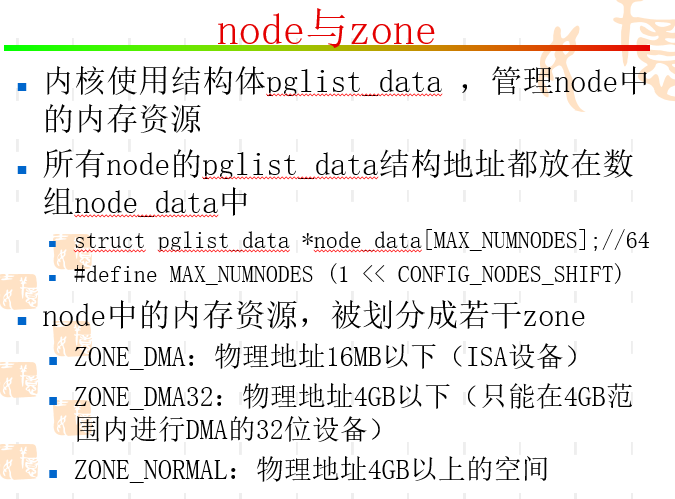

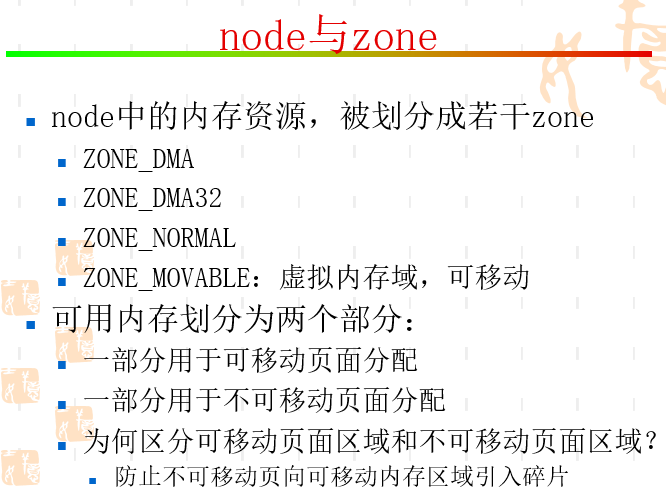

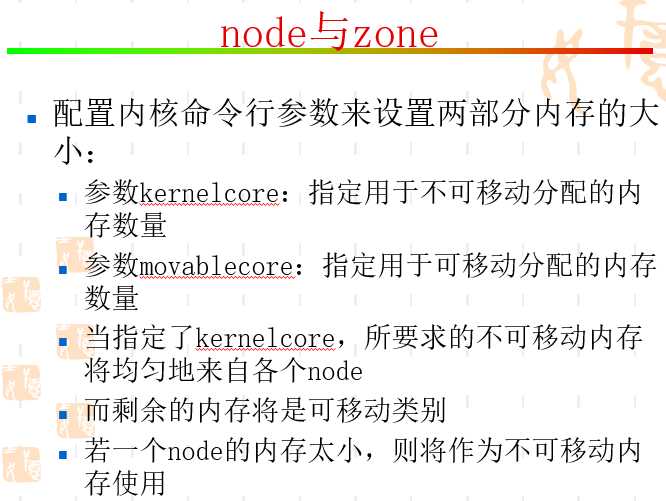

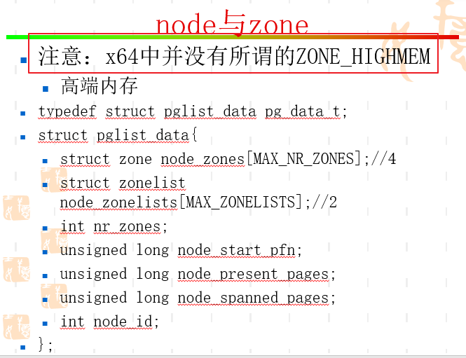

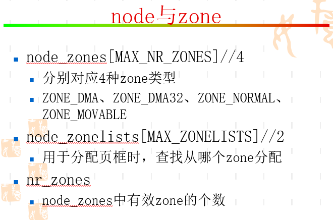

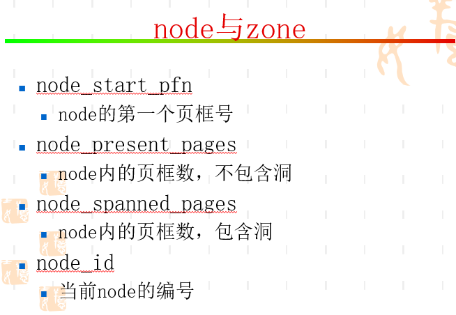

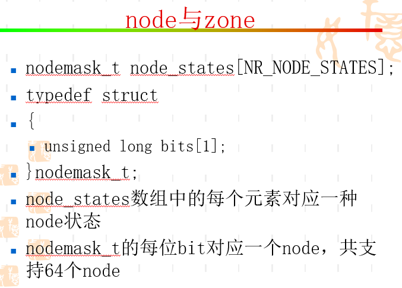

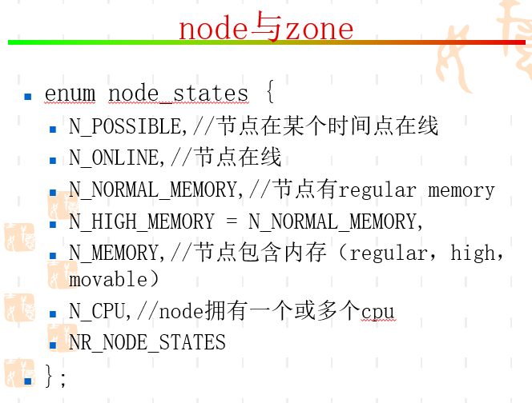

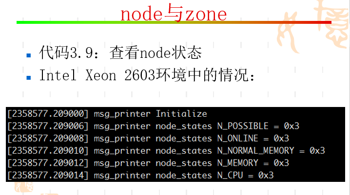

## zone

*  由于一些特殊的应用场景，导致只能分配特定地址范围内的内存（比如老式的ISA设备DMA时只能使用前16M内存；比如kmalloc只能分配低端内存，而不能分配高端内存），因此在node中又将内存细分为zone。

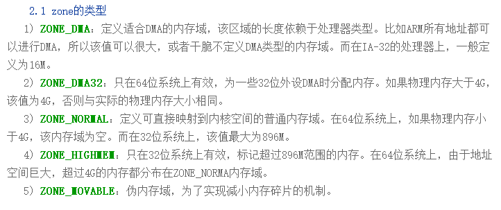

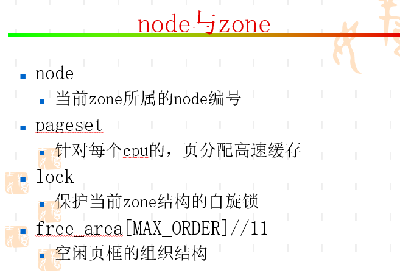

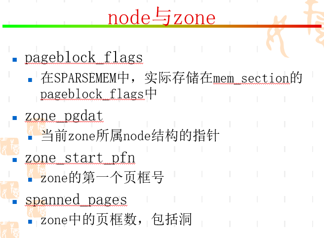

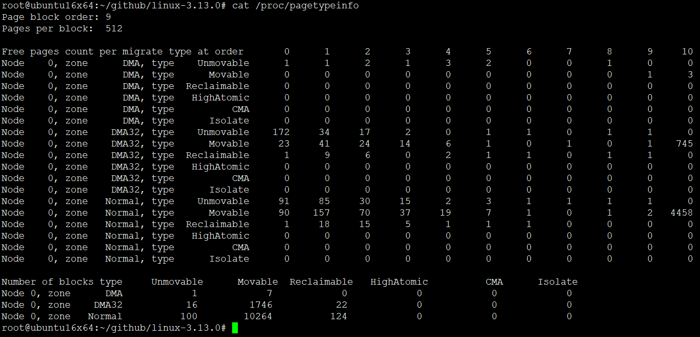

* 可以对比16MB DMA zone以下reserved页框数目spanned_pages-managed_pages

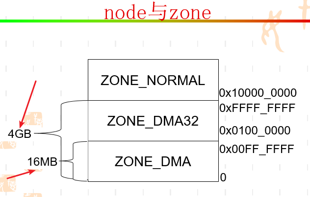

## 添加ZONE_MOVABLE

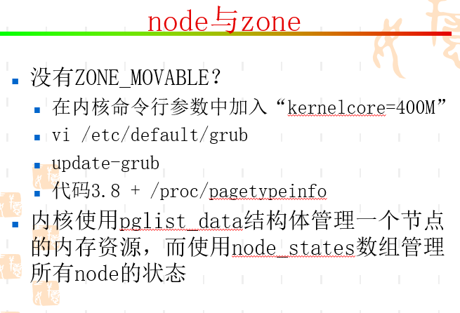

## page结构转node和zone

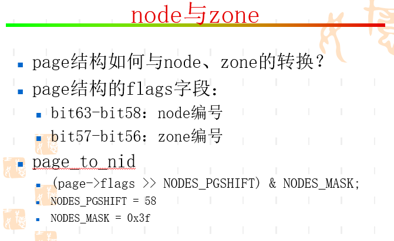

## 参考博客

<http://zhaoxinfeng.blog.chinaunix.net/uid-30282771-id-5171166.html>

## END
