<!-- TOC depthFrom:1 depthTo:6 withLinks:1 updateOnSave:1 orderedList:0 -->

- [page+section+root](#pagesectionroot)
	- [page](#page)
	- [内核链表](#内核链表)
	- [section](#section)
	- [root](#root)
	- [root和section构建过程](#root和section构建过程)
	- [END](#end)

<!-- /TOC -->
# page+section+root

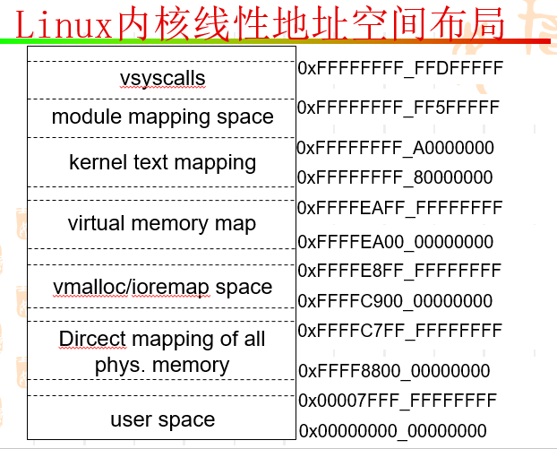

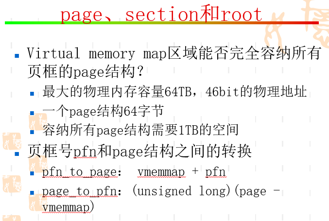

## page

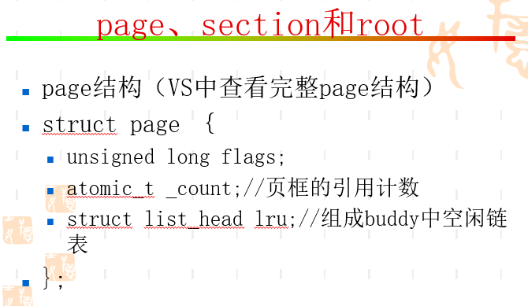

```
struct page {
	/* First double word block */
	unsigned long flags;		/* Atomic flags, some possibly
					 * updated asynchronously */
	union {
		/* See page-flags.h for the definition of PAGE_MAPPING_FLAGS */
		struct address_space *mapping;

		void *s_mem;			/* slab first object */
		atomic_t compound_mapcount;	/* first tail page */
		/* page_deferred_list().next	 -- second tail page */
	};

	/* Second double word */
	union {
		pgoff_t index;		/* Our offset within mapping. */
		void *freelist;		/* sl[aou]b first free object */
		/* page_deferred_list().prev	-- second tail page */
	};

	union {
		_slub_counter_t counters;
		unsigned int active;		/* SLAB */
		struct {			/* SLUB */
			unsigned inuse:16;
			unsigned objects:15;
			unsigned frozen:1;
		};
		int units;			/* SLOB */

		struct {			/* Page cache */
			/*
			 * Count of ptes mapped in mms, to show when
			 * page is mapped & limit reverse map searches.
			 *
			 * Extra information about page type may be
			 * stored here for pages that are never mapped,
			 * in which case the value MUST BE <= -2.
			 * See page-flags.h for more details.
			 */
			atomic_t _mapcount;

			/*
			 * Usage count, *USE WRAPPER FUNCTION* when manual
			 * accounting. See page_ref.h
			 */
			atomic_t _refcount;
		};
	};

	/*
	 * WARNING: bit 0 of the first word encode PageTail(). That means
	 * the rest users of the storage space MUST NOT use the bit to
	 * avoid collision and false-positive PageTail().
	 */
	union {
		struct list_head lru;	/* Pageout list, eg. active_list
					 * protected by zone_lru_lock !
					 * Can be used as a generic list
					 * by the page owner.
					 */
		struct dev_pagemap *pgmap; /* ZONE_DEVICE pages are never on an
					    * lru or handled by a slab
					    * allocator, this points to the
					    * hosting device page map.
					    */
		struct {		/* slub per cpu partial pages */
			struct page *next;	/* Next partial slab */
 #ifdef CONFIG_64BIT
			int pages;	/* Nr of partial slabs left */
			int pobjects;	/* Approximate # of objects */
 #else
			short int pages;
			short int pobjects;
 #endif
		};

		struct rcu_head rcu_head;	/* Used by SLAB
						 * when destroying via RCU
						 */
		/* Tail pages of compound page */
		struct {
			unsigned long compound_head; /* If bit zero is set */

			/* First tail page only */
			unsigned char compound_dtor;
			unsigned char compound_order;
			/* two/six bytes available here */
		};

 #if defined(CONFIG_TRANSPARENT_HUGEPAGE) && USE_SPLIT_PMD_PTLOCKS
		struct {
			unsigned long __pad;	/* do not overlay pmd_huge_pte
						 * with compound_head to avoid
						 * possible bit 0 collision.
						 */
			pgtable_t pmd_huge_pte; /* protected by page->ptl */
		};
 #endif
	};

	union {
		/*
		 * Mapping-private opaque data:
		 * Usually used for buffer_heads if PagePrivate
		 * Used for swp_entry_t if PageSwapCache
		 * Indicates order in the buddy system if PageBuddy
		 */
		unsigned long private;
 #if USE_SPLIT_PTE_PTLOCKS
 #if ALLOC_SPLIT_PTLOCKS
		spinlock_t *ptl;
 #else
		spinlock_t ptl;
 #endif
 #endif
		struct kmem_cache *slab_cache;	/* SL[AU]B: Pointer to slab */
	};

 #ifdef CONFIG_MEMCG
	struct mem_cgroup *mem_cgroup;
 #endif

	/*
	 * On machines where all RAM is mapped into kernel address space,
	 * we can simply calculate the virtual address. On machines with
	 * highmem some memory is mapped into kernel virtual memory
	 * dynamically, so we need a place to store that address.
	 * Note that this field could be 16 bits on x86 ... ;)
	 *
	 * Architectures with slow multiplication can define
	 * WANT_PAGE_VIRTUAL in asm/page.h
	 */
 #if defined(WANT_PAGE_VIRTUAL)
	void *virtual;			/* Kernel virtual address (NULL if
					   not kmapped, ie. highmem) */
 #endif /* WANT_PAGE_VIRTUAL */

 #ifdef LAST_CPUPID_NOT_IN_PAGE_FLAGS
	int _last_cpupid;
 #endif
} _struct_page_alignment;
```

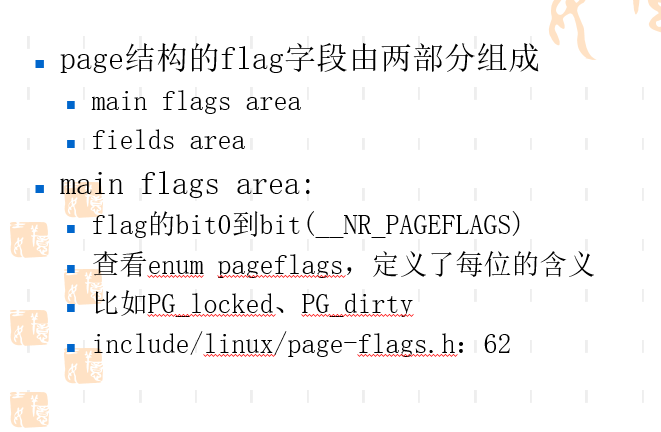

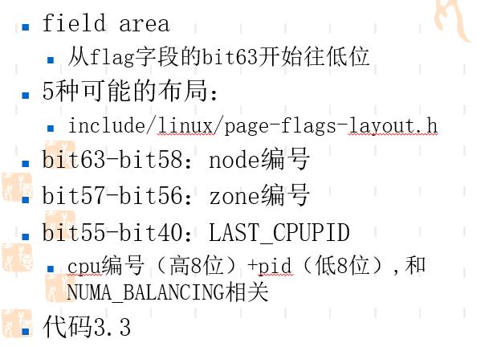


* 内核将物理内存划分为一个个 4K or 8K 大小的小块（物理页），而这一个个小块就对应着这个page结构，它是内核管理内存的最小单元


## 内核链表

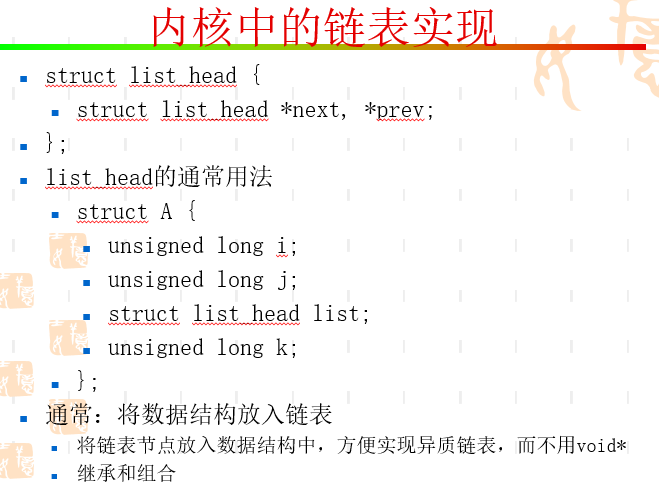

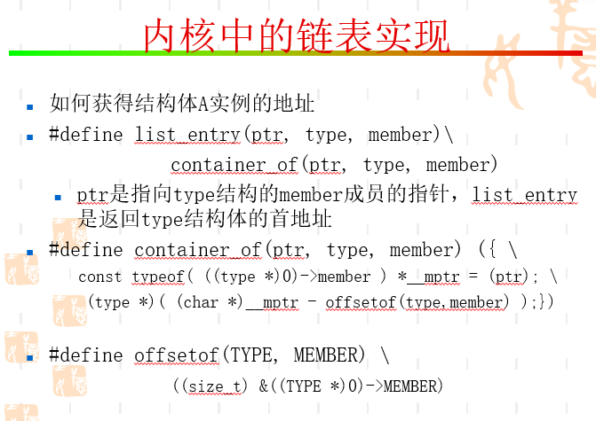

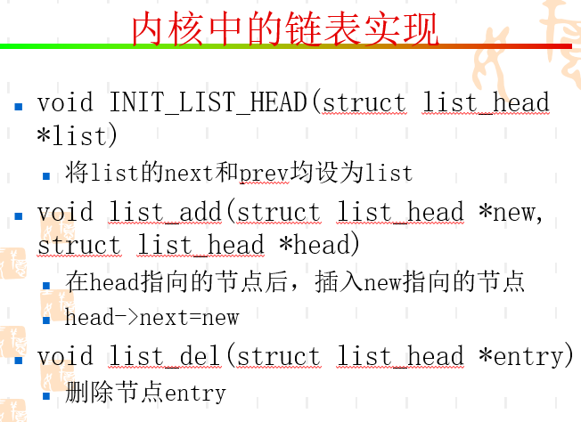


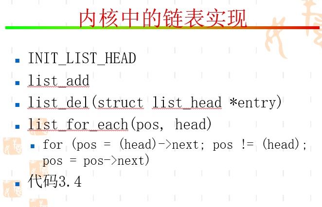

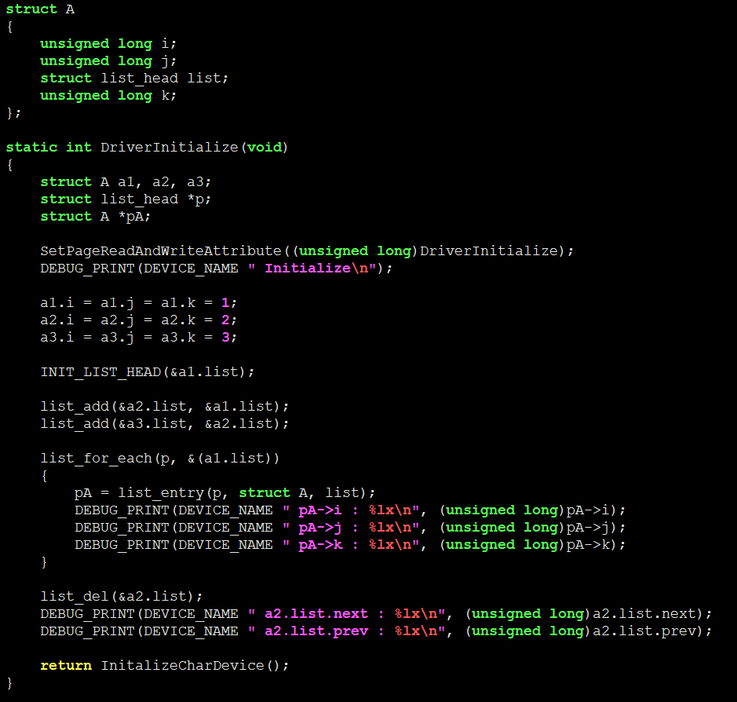


## section


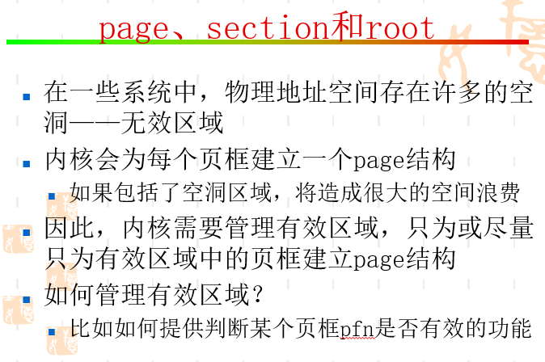

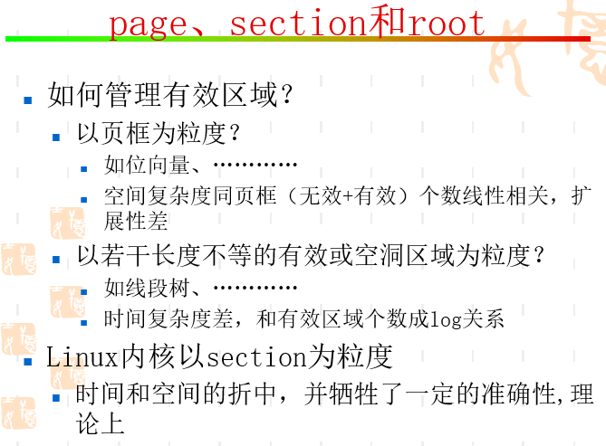

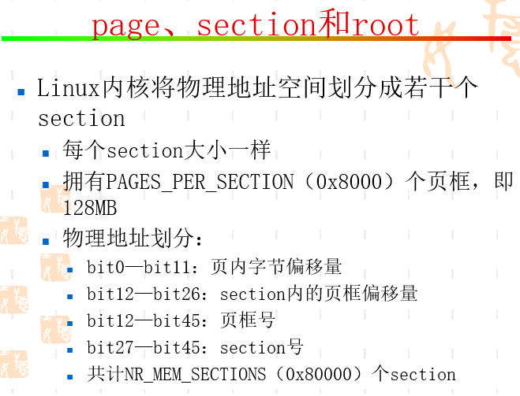

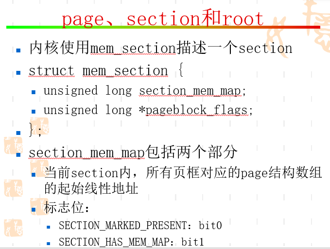

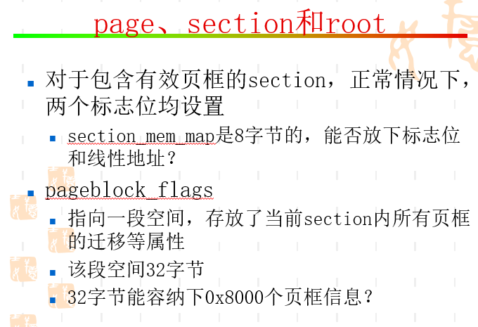

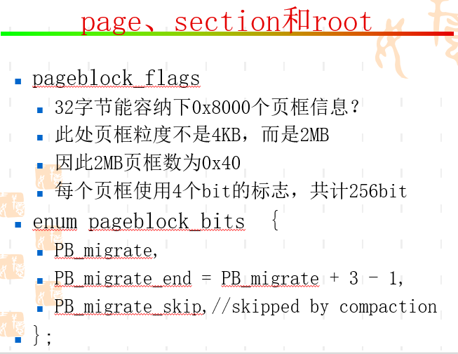


## root

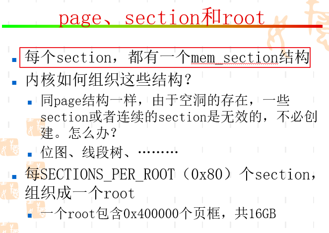

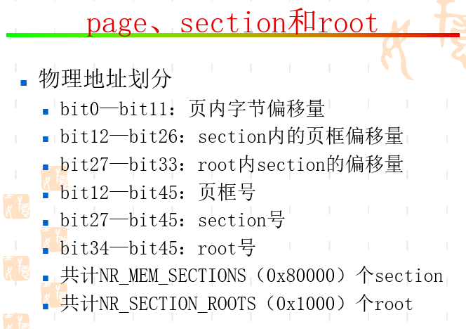

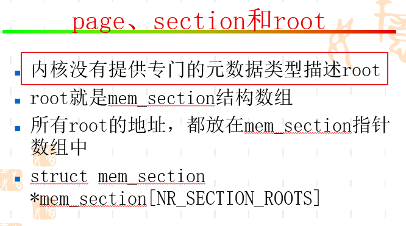

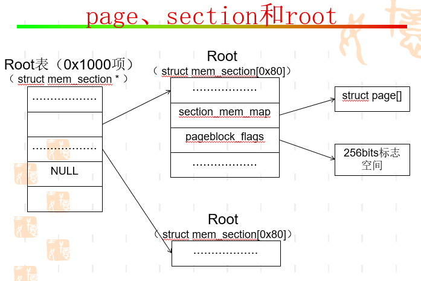

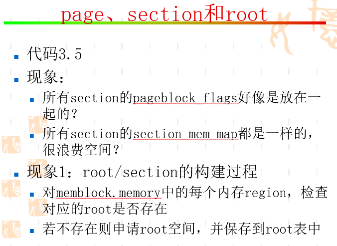

## root和section构建过程

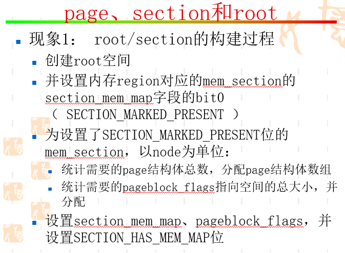

* 一个node内，所有页框的page在物理上是连续的。这也是符合NUMA访问优化要求结构的。不要出现在node a上的page结构，描述的是node b上的页框


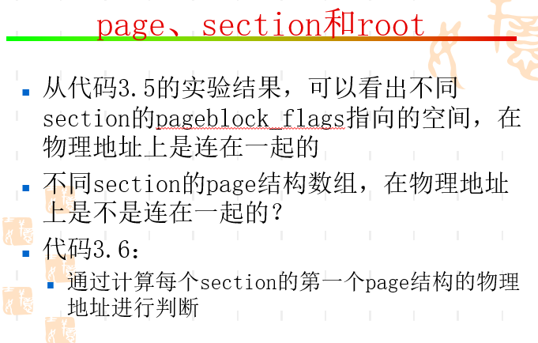

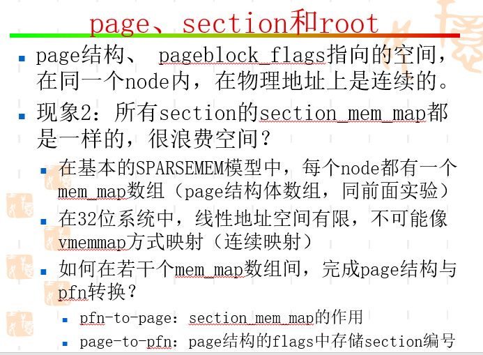

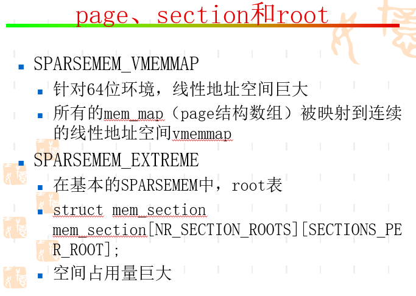

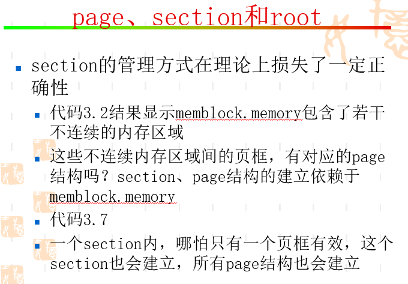

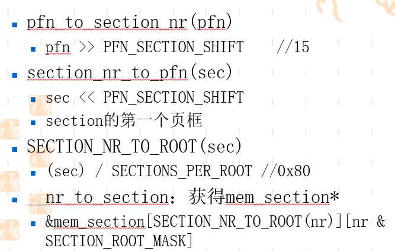


## END
