<!-- TOC depthFrom:1 depthTo:6 withLinks:1 updateOnSave:1 orderedList:0 -->

- [内存探测](#内存探测)
	- [15号中断e820](#15号中断e820)
	- [全局实例boot_params](#全局实例bootparams)
	- [SMP共享存储多处理器体系结构](#smp共享存储多处理器体系结构)
		- [UMA](#uma)
		- [NUMA](#numa)
	- [memblock_region中的nid](#memblockregion中的nid)
	- [END](#end)

<!-- /TOC -->

# 内存探测

## 15号中断e820

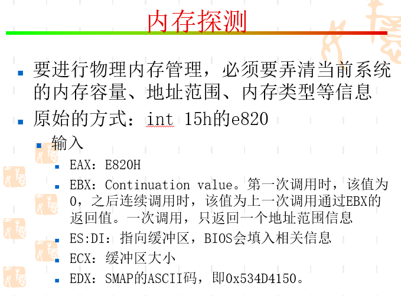

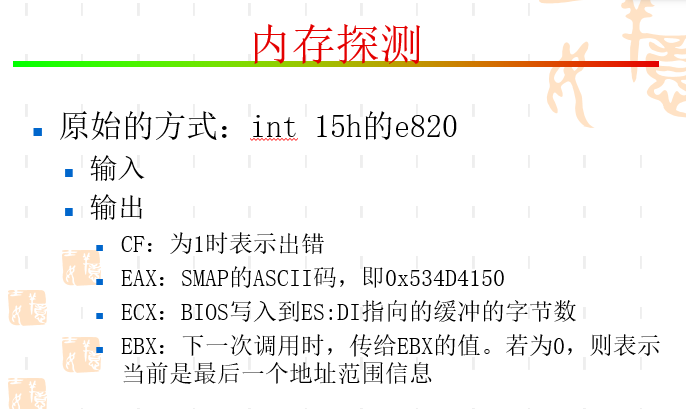

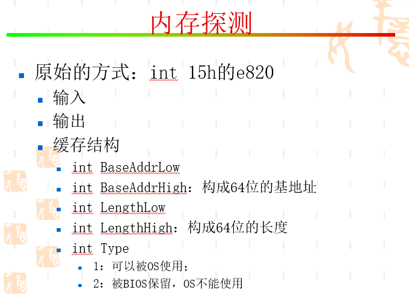

* 使用BIOS中断调用，说明低端1MB处BIOS中断向量及服务程序都还在。应该是介于实模式和保护模式切换中间任务。

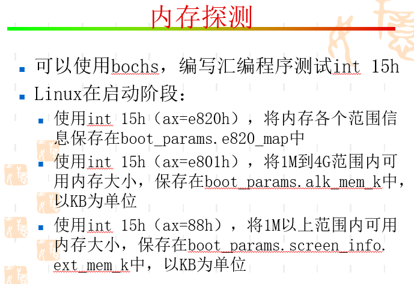


* 这句话就很明显，实模式下获取内存信息

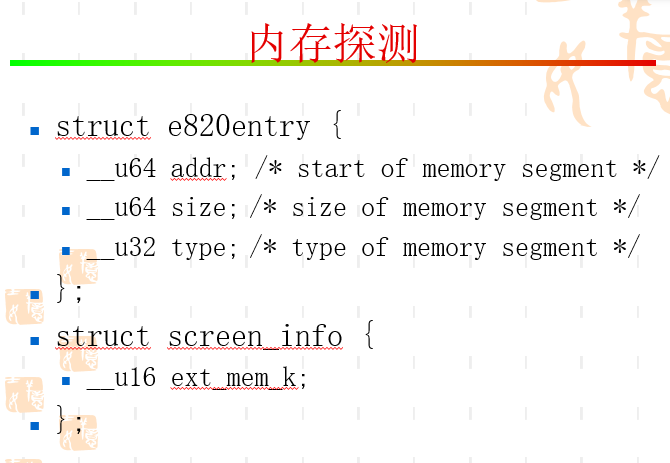

## 全局实例boot_params

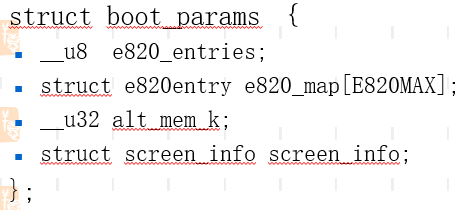


* 全局实例boot_params
* 一个是boot_params数据结构中的一个字段，只是名字叫hdr。在这里第一次见到boot_params，它是在arch/x86/include/asm/Bootparam.h文件中定义。这里第一次出现，接下来的大部分工作都是填充这个boot_params。这个boot_params来头可不小，它刚好是一个页面的大小。在arch/x86/boot/Main.c的第18行：
```
struct boot_params boot_params __attribute__((aligned(16)));
```
* 注意，这个变量boot_params是main.c的全局变量，且未被初始化，所以位于BSS段。grub把vmlinuz加载进内存后，boot_params就位于_bss_start的开始位置。而后面当启动保护模式的分页功能后，第一个页面就是从它开始的（注意，不是从0x0开始的喔）。所以内核注释它为“zeropage”，即所谓的0号页面，足见这个boot_params的重要性

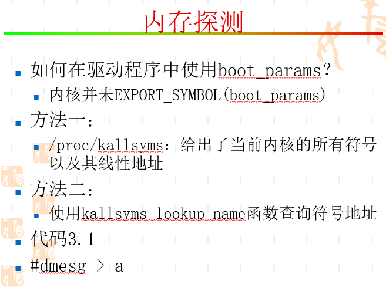

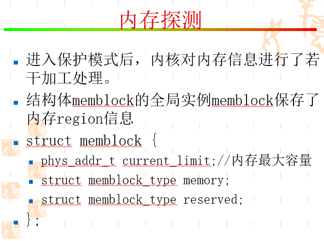

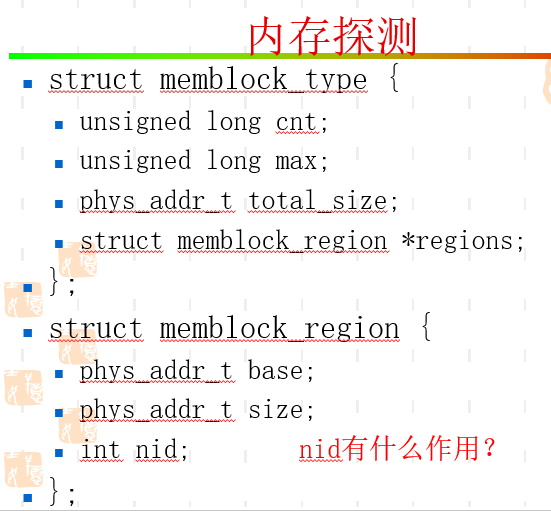

* nid就是node id，作为NUMA非常有用，标记每个NUMA node
* 说明获取内存信息的途径，从e820、boot_param，到memblock画出memblock示意

## SMP共享存储多处理器体系结构

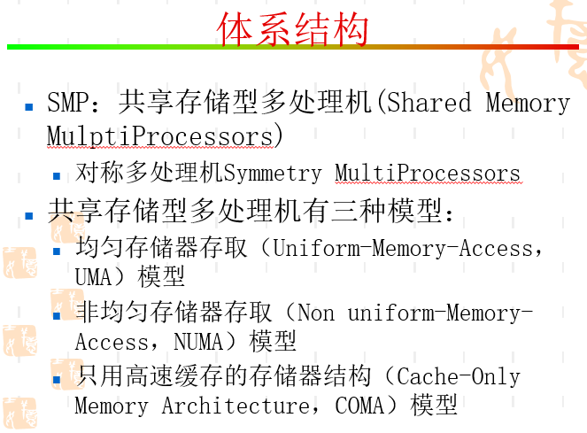

### UMA


### NUMA

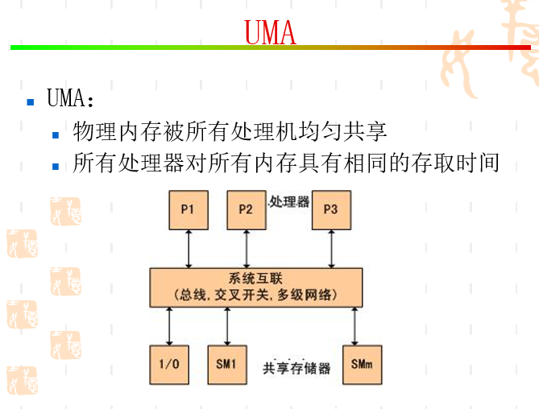

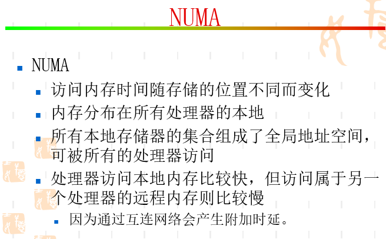

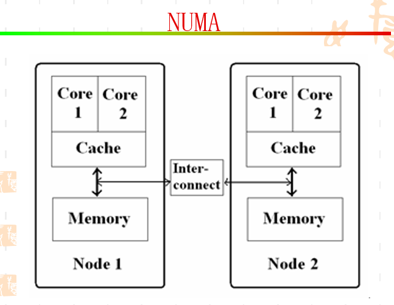

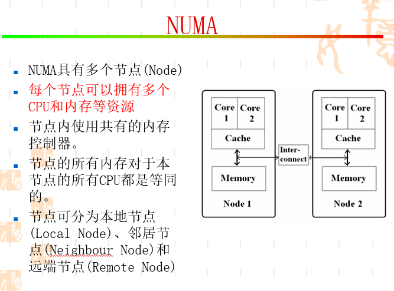

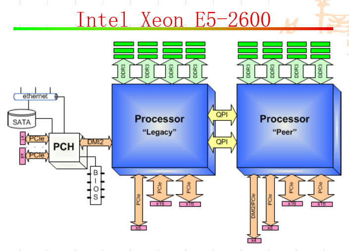

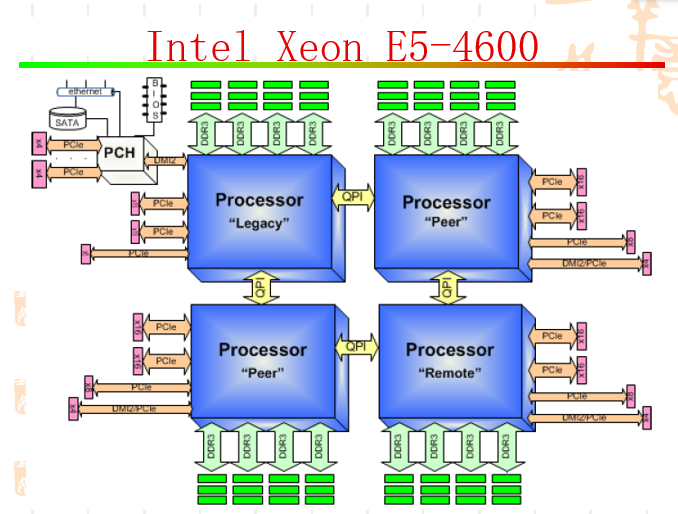

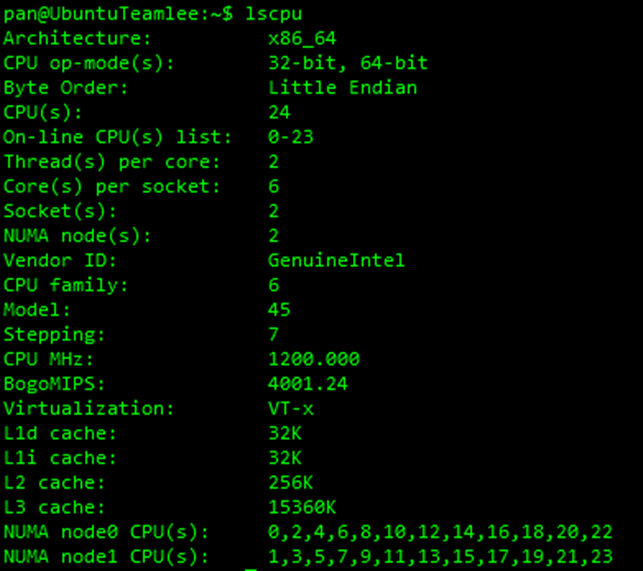

## memblock_region中的nid

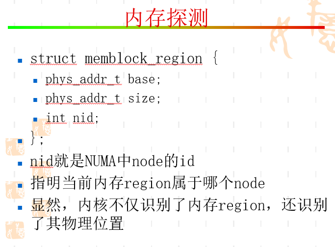

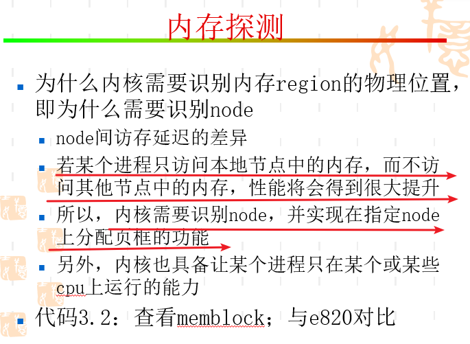

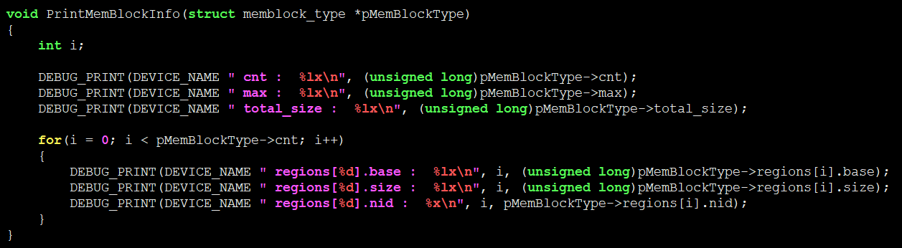

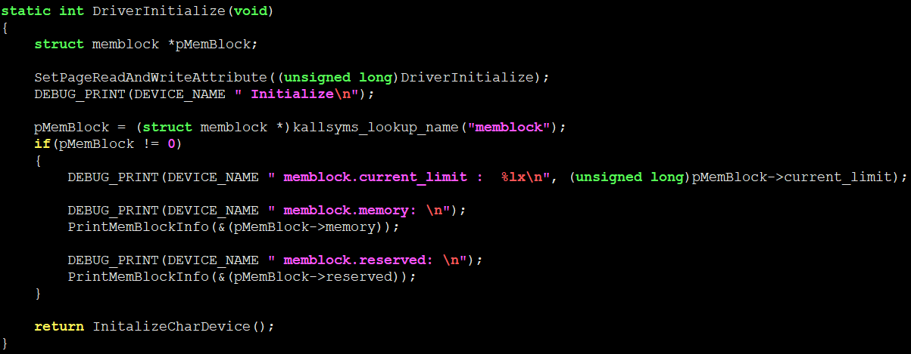


## END
