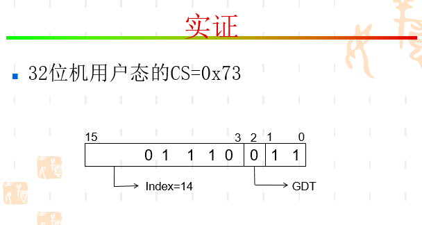
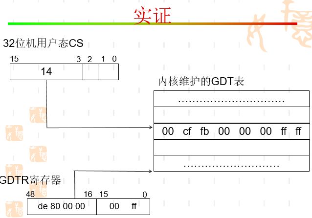
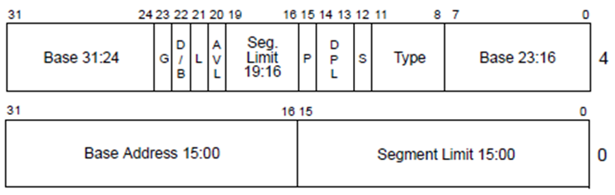
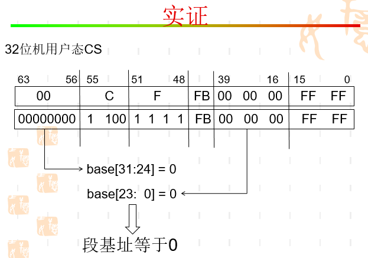
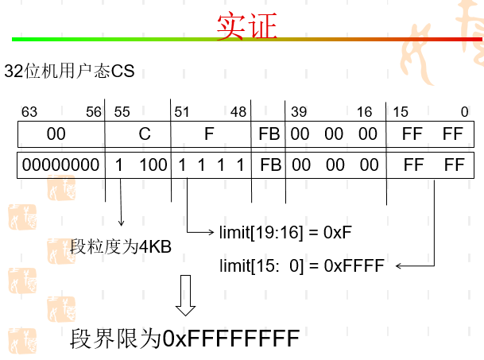
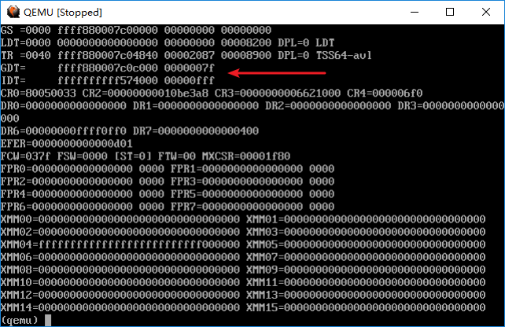
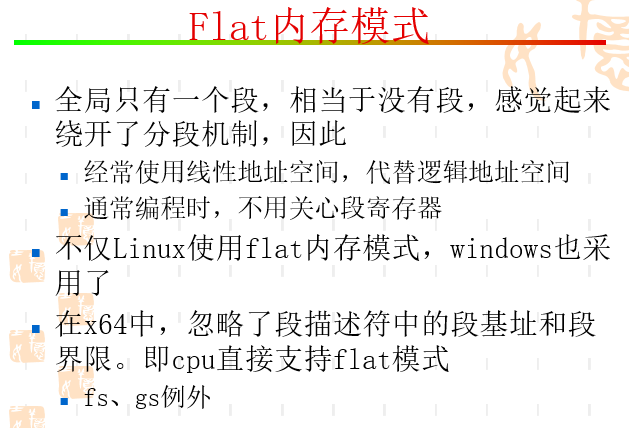

# Flat内存模式

## 疑问

* 进程线性地址空间和逻辑地址空间什么区别？

* 内核初始化阶段设置GDT和IDT
* 设置GDT和IDT有专门的特权指令lgdt、lidt
* GDTR和IDTR都是48位寄存器：16bit偏移+32bit物理地址

## 实证

* 不管用户态还是内核态，CS都设置为[0,0xFFFF-FFFF]。因此，全局只有一个段flat模式
* 段基址就是都是0，本来线性地址 = 段基址+偏移量，但是段基址为0，那么线性地址=偏移量

## END
