<!-- TOC depthFrom:1 depthTo:6 withLinks:1 updateOnSave:1 orderedList:0 -->

- [Linux的分页管理](#linux的分页管理)
	- [32位页表-二级页表](#32位页表-二级页表)
	- [PAE页表-三级页表](#pae页表-三级页表)
	- [64位页表4K页面-四级页表](#64位页表4k页面-四级页表)
	- [64位页表2MB页面-三级页表](#64位页表2mb页面-三级页表)
	- [64位的页表1GB页面-二级页表](#64位的页表1gb页面-二级页表)
	- [Linux的分页管理](#linux的分页管理)
	- [页表项结构](#页表项结构)
	- [ini3(0xcc)CPU异常](#ini30xcccpu异常)
	- [Linux内核线性地址空间布局](#linux内核线性地址空间布局)
	- [kgdb异常原因分析](#kgdb异常原因分析)
	- [内核页表管理操作](#内核页表管理操作)
	- [2MB页表项结构](#2mb页表项结构)
	- [END](#end)

<!-- /TOC -->
# Linux的分页管理

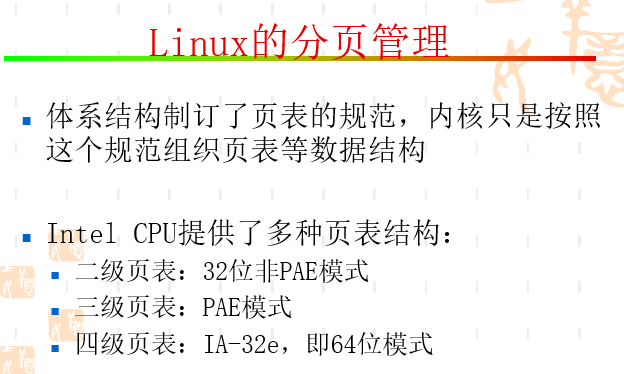

## 32位页表-二级页表

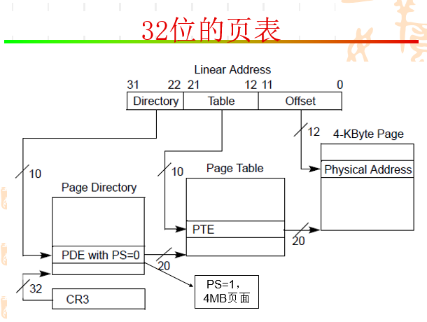

## PAE页表-三级页表

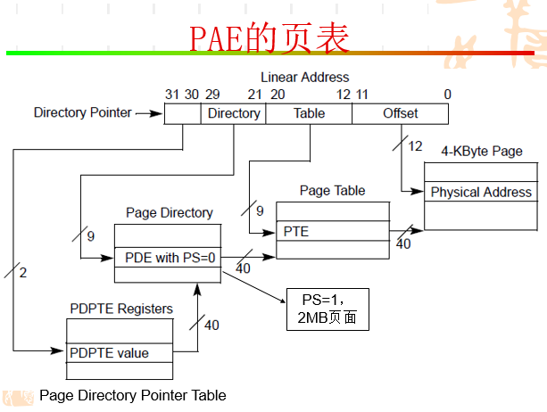

## 64位页表4K页面-四级页表

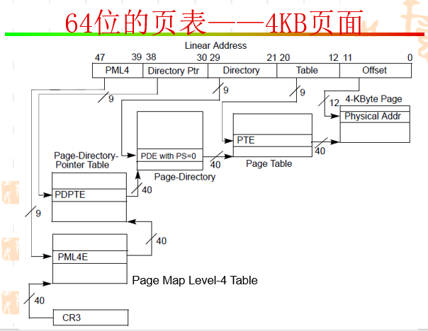

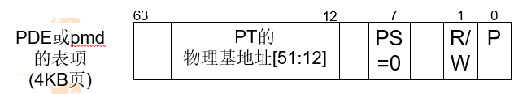

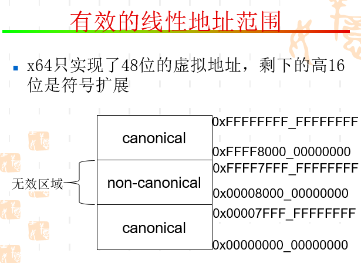

## 64位页表2MB页面-三级页表

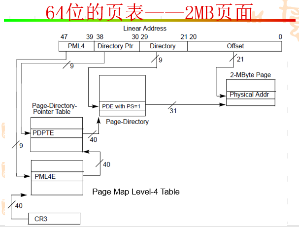

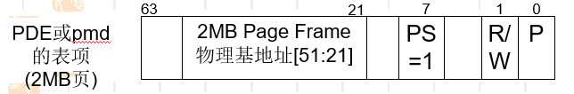

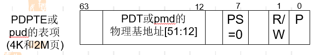

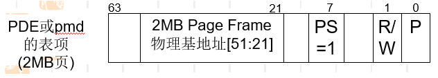

## 64位的页表1GB页面-二级页表

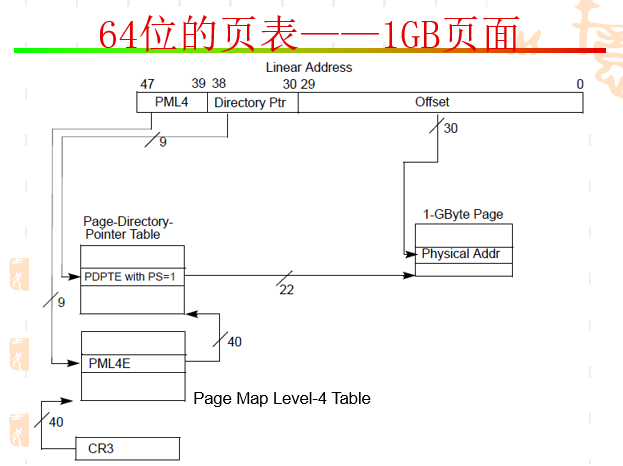

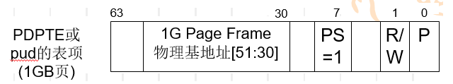

## Linux的分页管理

## 页表项结构

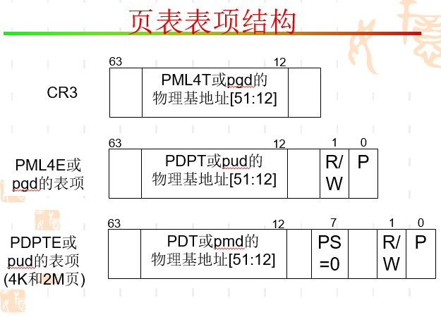

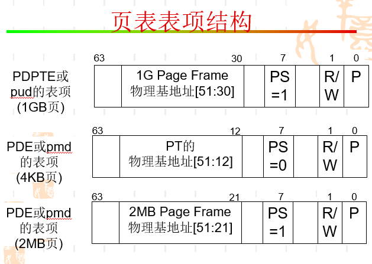

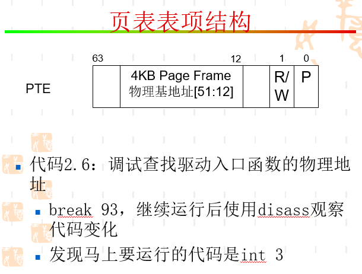

## ini3(0xcc)CPU异常

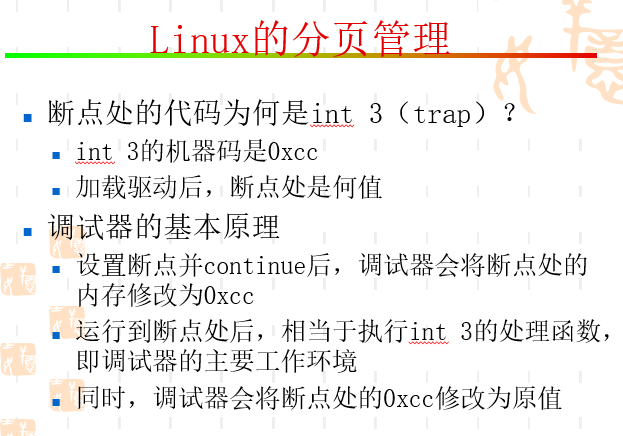

## Linux内核线性地址空间布局

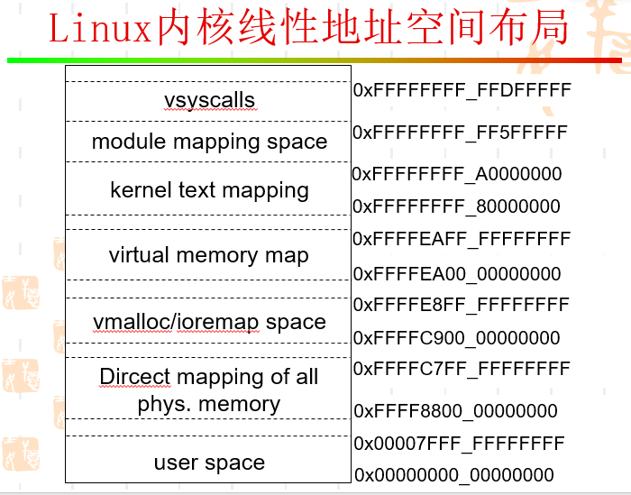

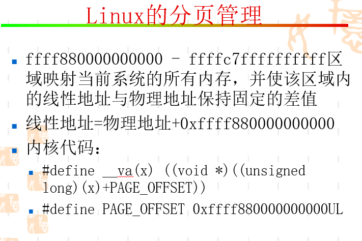

## kgdb异常原因分析

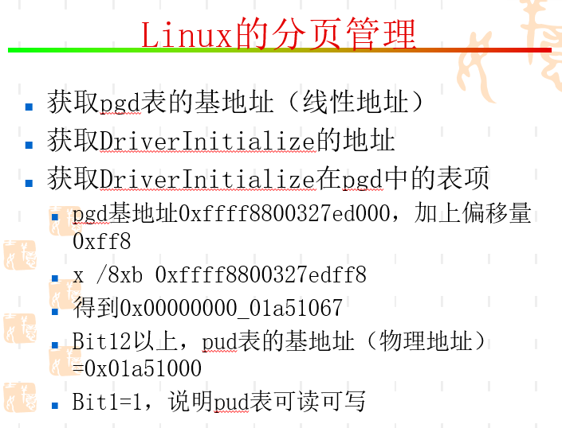

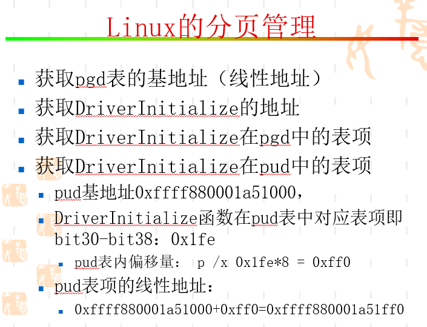

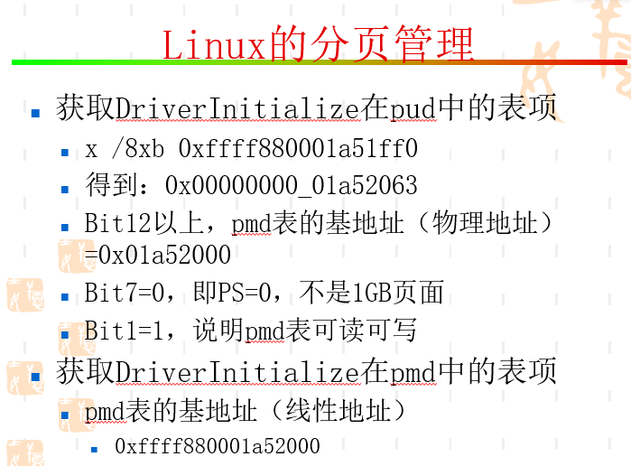

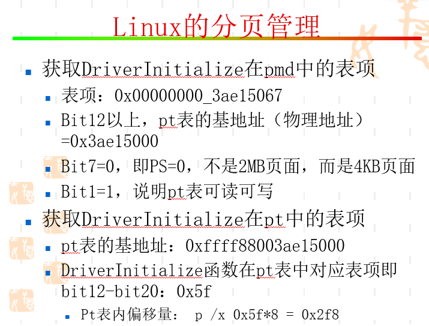

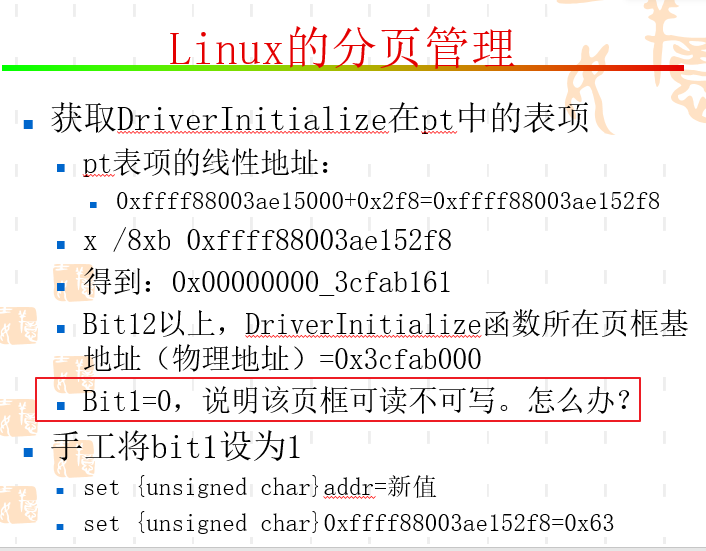

## 内核页表管理操作

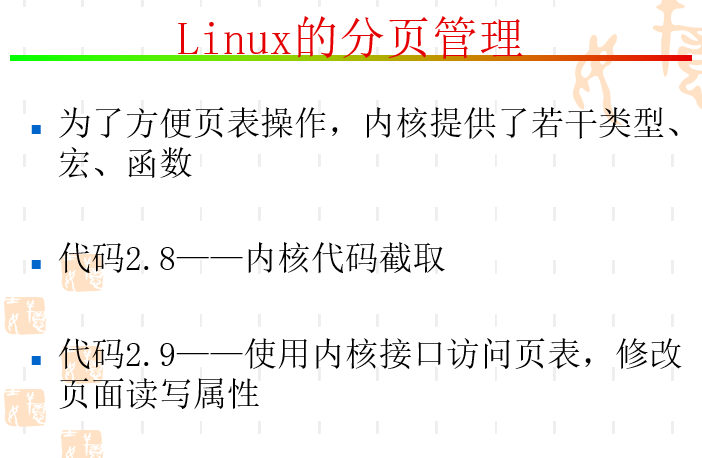

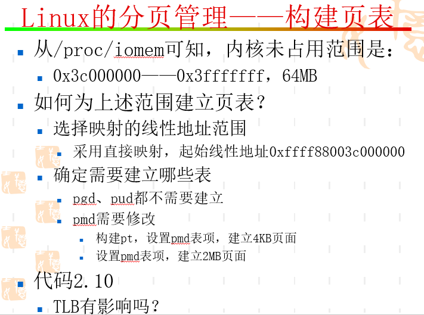

## 2MB页表项结构

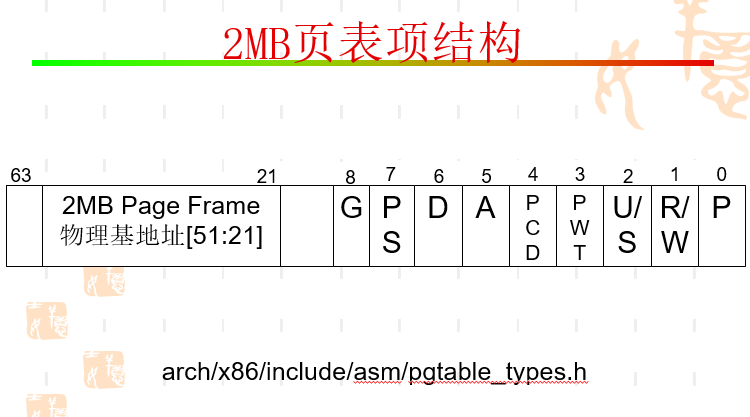

## END
