# Slub分配器的实现

## Slub分配器的数据结构

### kmalloc用的缓冲区

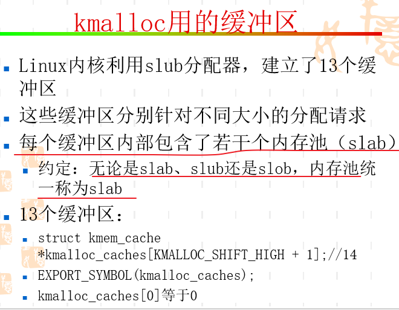

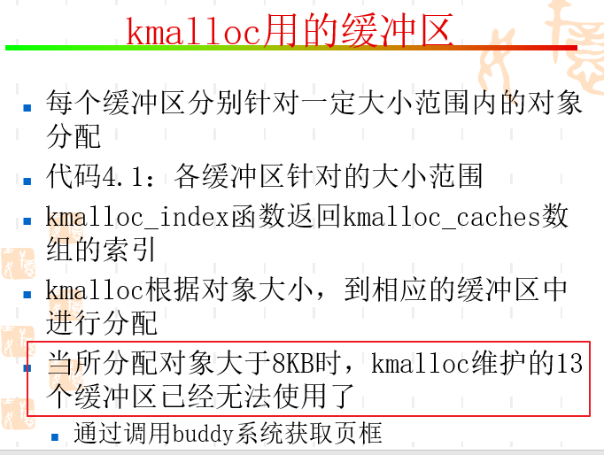

### 缓冲区内部结构

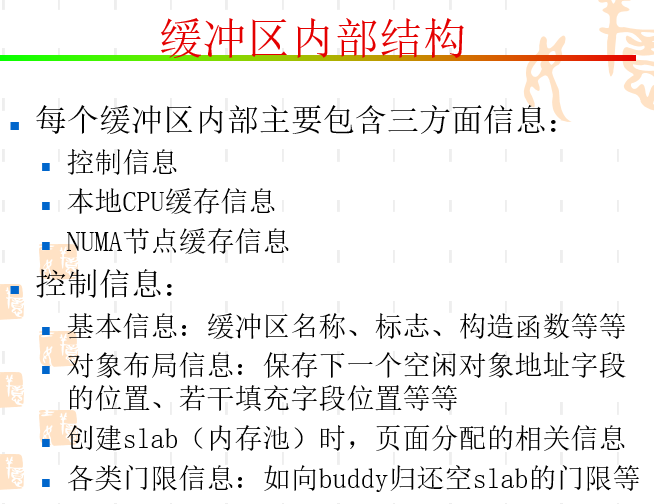

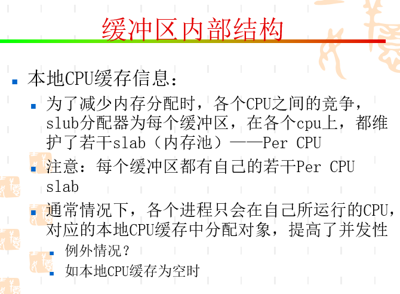

* 进程根据对象大小找到相应的缓冲区，再根据当前所运行的cpu，找到对应地本地cpu缓存

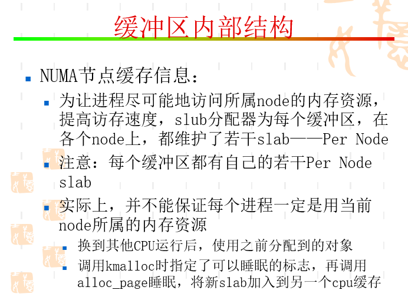

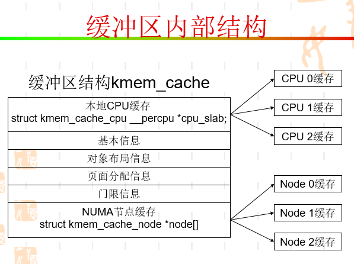

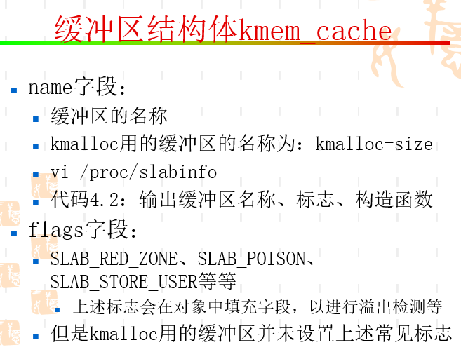

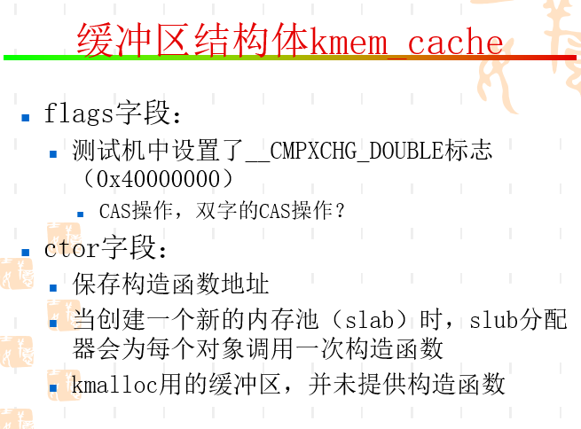

* 解释连续16字节和两个不同地址8字节cas，单向和双向链表问题

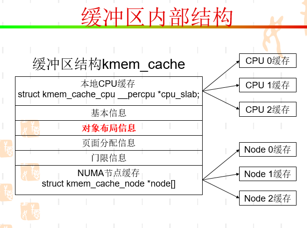

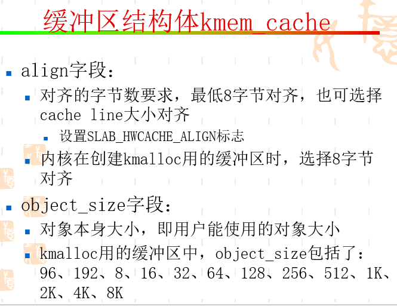

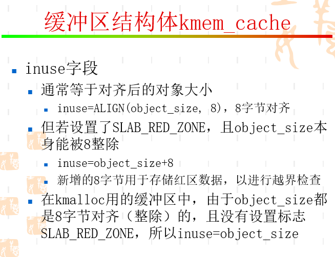

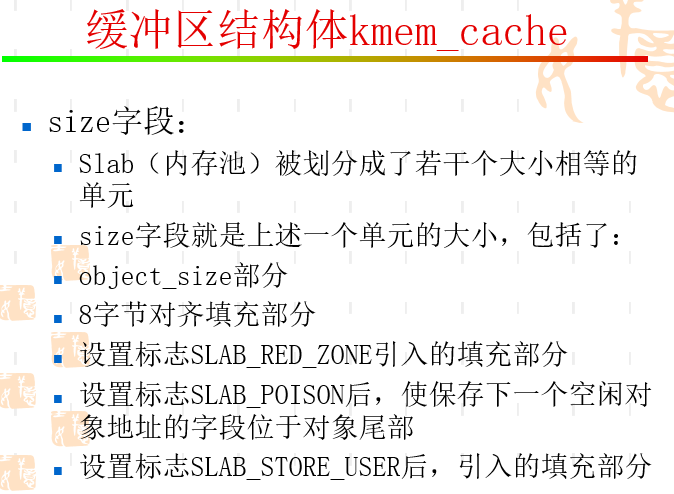

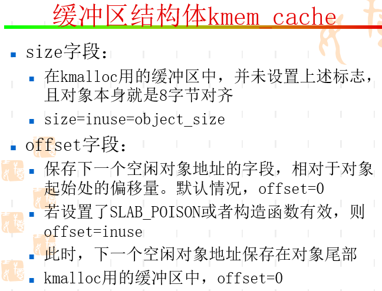

## Slub分配器中对象布局

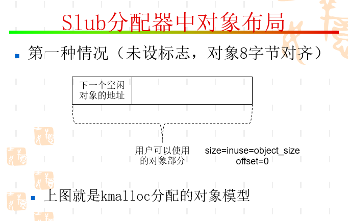

## 内存分配函数

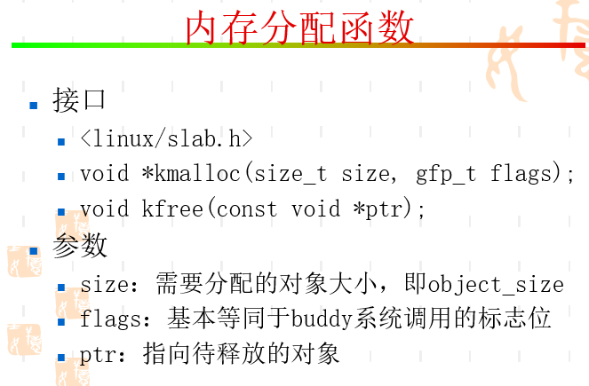

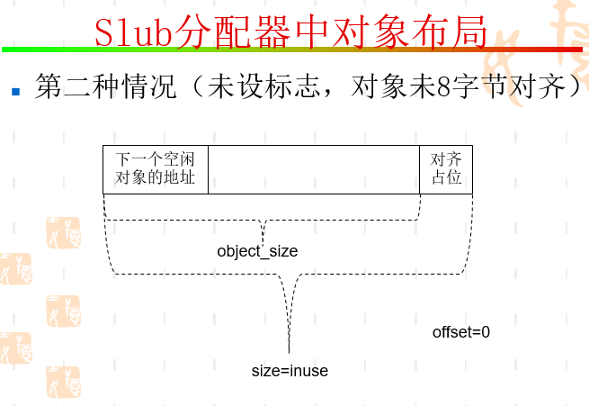

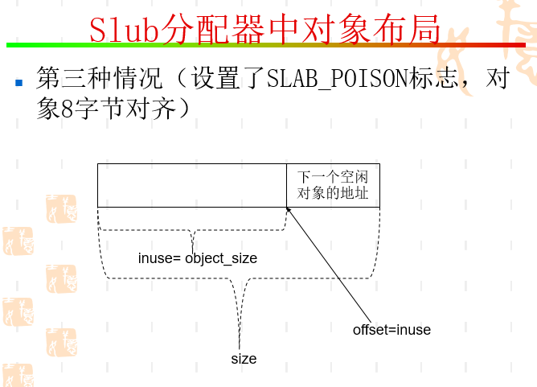

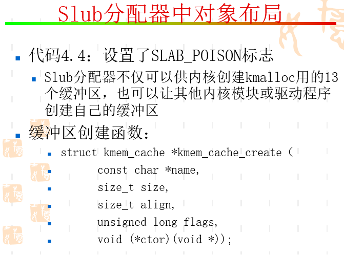

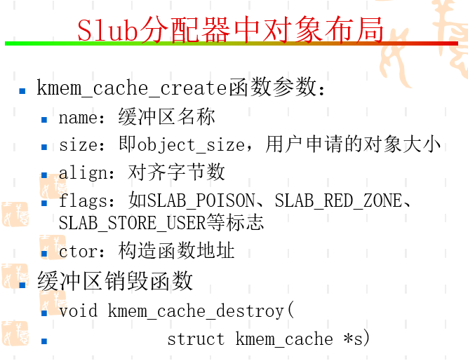

## 分配操作

## 释放操作

## 并发问题

## Slub分配器的初始化

## END
