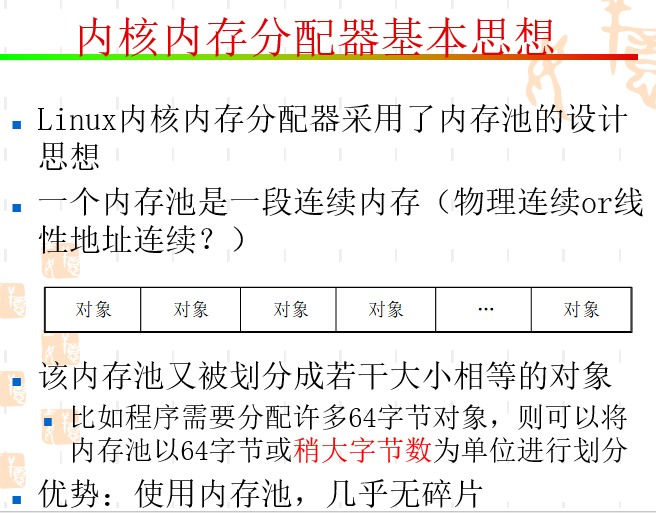
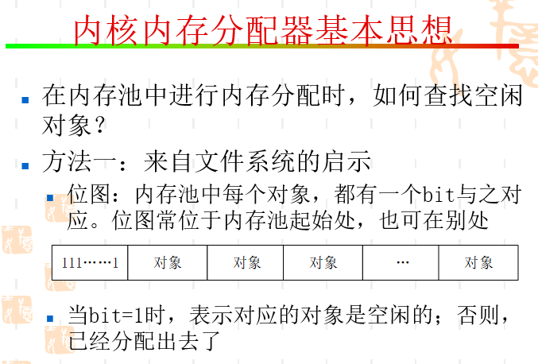
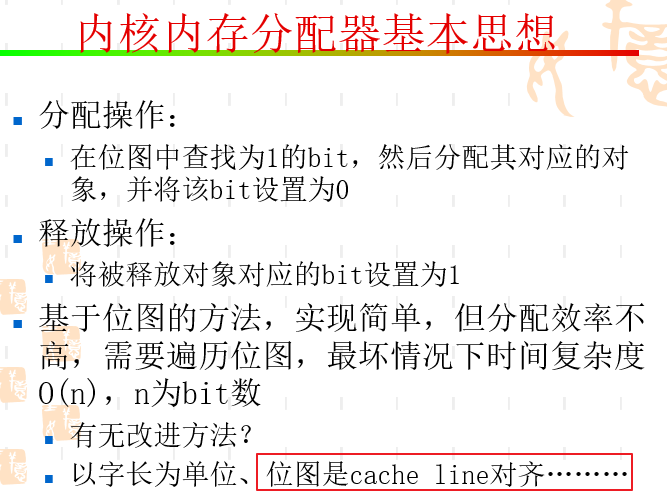
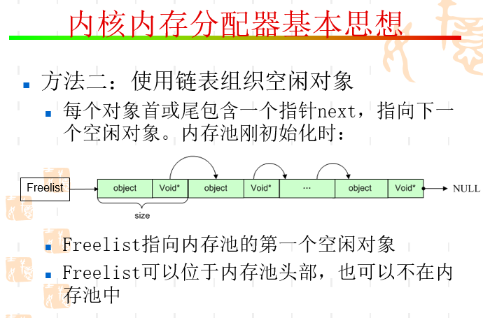
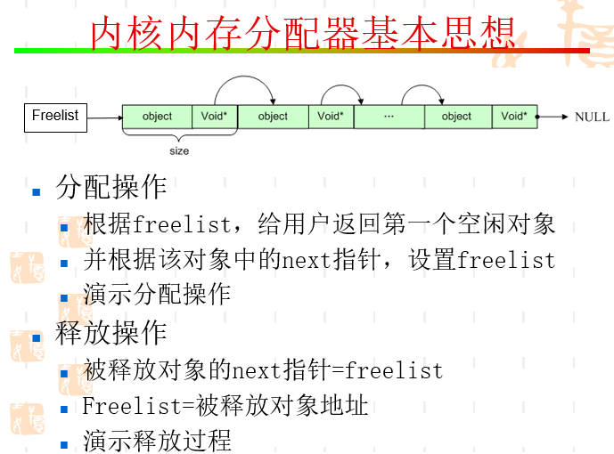
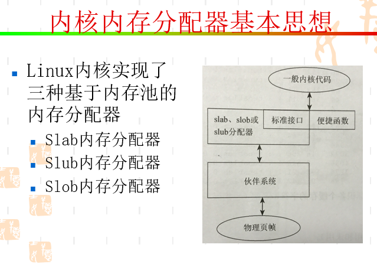
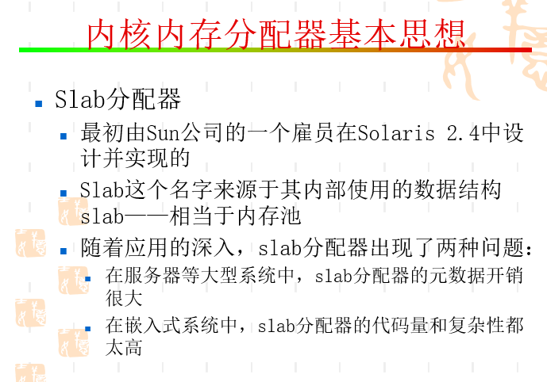
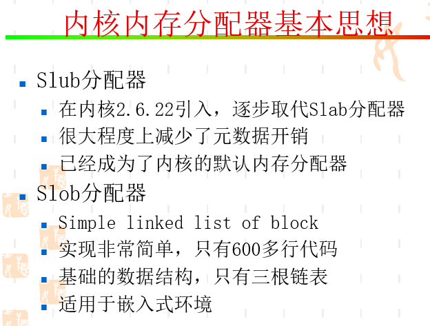

# 内核内存分配器基本思想

* 内核内存分配

* 改进：一次读取一个cache line，64*8bits；每8字节判断是否有非0，并使用bsr等指令；缓存上次分配对象对应地bit处，从该处开始查找。一是该处很可能已在cache中，二是该处后面的对象很可能空闲

* 对于64*8bits对象数的内存池，一次就可以全部进入cache，下一次访问时在cache中的概率大

## END
